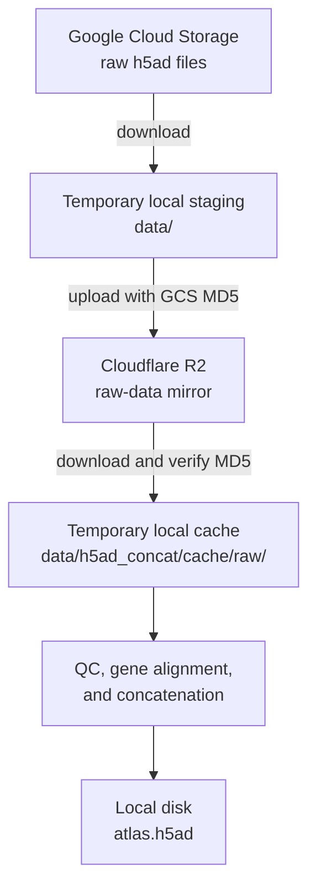

# scBaseCount pipeline

Master's project, 30 hp, Lund University

A large-scale scRNA-seq atlas and automated clustering parameter selection pipeline, built on the Arc Institute's [Virtual Cell Atlas](https://console.cloud.google.com/storage/browser/arc-institute-virtual-cell-atlas?pageState=(%22StorageObjectListTable%22:(%22f%22:%22%255B%255D%22))).

# Requirements

- [uv](https://docs.astral.sh/uv/getting-started/installation/) (package manager)
- Python 3.12.12 (installed automatically by uv)

> Python 3.12 is in security-only support as of September 2026 until October 2028. I pinned the interpreter at 3.12.12 (see [.python-version](.python-version)) so anyone reproducing my work with uv will install the same patch I used.


# Repository layout

The repo splits reusable code, batch orchestration, and interactive analysis:

- [scripts/](scripts/): Importable Python packages shared across notebooks, pipelines, and ad hoc use. See [scripts/README.md](scripts/README.md). The directory was named at the beginning of the project, but if I were building this today, the more appropriate name would be `src/`.
- [pipelines/](pipelines/): Batch runners for long, unattended jobs on a server (many accessions, sustained runtime). See [pipelines/README.md](pipelines/README.md).
- [notebooks/](notebooks/): Interactive workflows for one-off or short tasks, and for repeatable steps where reviewing outputs (figures, tables, spot checks) is part of the work. See [notebooks/README.md](notebooks/README.md).

[pipelines/](pipelines/) contains the code that you (the reviewer) will run to reproduce the work presented in the [report](docs/report/report.pdf).

[docs/report/scripts/](docs/report/scripts/) contains some small scripts that generate the plots and tables in the [report](docs/report/report.pdf).

# Resources required

The following resources are required to replicate the work presented in the [report](docs/report/report.pdf)

- Data access
  - Access to the populated R2 raw-data mirror described below
  - Optional: a Google Cloud account and billing project subscribed to the Virtual Cell Atlas Marketplace dataset, only when building a new mirror
- Compute
  - Ca 100 GB disk space
  - Ca 2 TB RAM
  - Persistent shell session (e.g. `tmux`) or detached process (e.g. `nohup`)

Because the data aquisition pipeline (shown below) requires Google Cloud Credentials (see [output/migration/README.md](output/migration/README.md)) and a Cloudflare R2 bucket, I can supply you with the concatenated, single file atlas, which I have archived on the Lund University Bioinformatics course server. If I give you the file, skip to [step 5](#5-calibrate-on-the-deterministic-100000-cell-sample) of the pipeline.




## Data access


### Google Cloud

A Google Cloud account and project are only needed when downloading source data to build a new mirror. The [Google Cloud SDK](https://cloud.google.com/sdk/docs/install-sdk) is used via `google-cloud-storage` (locked in [uv.lock](uv.lock)).

The historical GCS-to-R2 transfers, including their repository snapshots, input CSVs, and run manifests, are recorded in [output/migration/README.md](output/migration/README.md).

### Cloudflare R2

Raw input and processed `h5ad` files are stored in Cloudflare's S3-compatible R2 storage. Credentials are required (see [.env.example](.env.example)).

### Optional API keys

NCBI and CyteType API keys support workflows outside the report. Neither is required for the steps below.

# Reproducibility

If you have access to the resources required, you can reproduce the work presented in [docs/report/report.pdf](docs/report/report.pdf) by following the steps below.

## Setup

```sh
git clone git@github.com:otodreas/scBaseCount_Pipeline.git
cd scBaseCount_Pipeline
uv sync --locked --group dev
```


### Install pre-commit and pre-push hooks (not recommended)

Since this step aids in development rather than reproduction, it is not recommended for a reviewer.

```sh
git config core.hooksPath .githooks   # once per clone
```

[.githooks/pre-commit](.githooks/pre-commit) runs ruff and nbstripout on staged files; [.githooks/pre-push](.githooks/pre-push) runs the cluster validation regression test when [scripts/cluster_validation/](scripts/cluster_validation/) changed. Both are optional local help; [.github/workflows/ci.yml](.github/workflows/ci.yml) enforces ruff, pytest, and stripped [notebooks/](notebooks/) on `main`.

Files under `logs/` are created if missing and appended across runs.

## Run the pipeline

Run every command from the repository root. The steps of the pipeline, their outputs, and the logs they produce are summarized below.


| Step | Runner                                                                                     | Output                                                                                                                              | Log                                                                                                      |
| ---- | ------------------------------------------------------------------------------------------ | ----------------------------------------------------------------------------------------------------------------------------------- | -------------------------------------------------------------------------------------------------------- |
| 1    | Optional [pipelines/build_datasets_v2.py](pipelines/build_datasets_v2.py)                | `output/metadata/datasets_v2.csv`                                                                                                   | `logs/study_context.log`; lookup progress also goes to the terminal                                      |
| 2    | Optional [pipelines/migrate_gcs_to_r2.py](pipelines/migrate_gcs_to_r2.py)                | Raw R2 objects; `output/migration/<timestamp>/run.csv`                                                                              | `logs/migrate_gcs_to_r2.log`; `logs/gcs.log` for downloads; `logs/r2.log` for transfers                  |
| 3    | [pipelines/run_clustering_pipeline.py](pipelines/run_clustering_pipeline.py)             | `output/clustering_pipeline/<timestamp>/run.csv`, `metadata.json`, `figs/`, and `data/`; clustered R2 objects                       | `logs/clustering_pipeline.log`; `logs/cluster_validation.log`; `logs/r2.log`; `logs/gcs.log` on fallback |
| 4    | [pipelines/run_atlas_concat.py](pipelines/run_atlas_concat.py)                           | Configured atlas; sibling `<stem>_config.json`, `<stem>_files.jsonl`, and `<stem>_result.json`                                      | `logs/h5ad_concat.log`; `logs/r2.log`. The JSONL file is reset, then appended per input                  |
| 5    | [pipelines/select_atlas_parameters.py](pipelines/select_atlas_parameters.py) `calibrate` | Configured calibration directory: `metrics/`, `figures/`, `calibration_summary.json`, and `parameters_template.json`                | `logs/select_atlas_parameters.log`                                                                       |
| 6    | [pipelines/select_atlas_parameters.py](pipelines/select_atlas_parameters.py) `validate`  | Configured validation directory: subset h5ad, `atlas_pp_subset_run.json`, `subset_validation_summary.json`, `figures/`, and `scib/` | `logs/select_atlas_parameters.log`                                                                       |
| 7    | [pipelines/run_atlas_postprocessing.py](pipelines/run_atlas_postprocessing.py)           | Configured output h5ad, `<output_stem>_run.json`, and figures                                                                       | `logs/atlas_postprocessing.log`                                                                          |


Shared imports can also create empty `logs/gcs.log`, `logs/r2.log`, or `logs/cluster_validation.log`.

### 0. Set up a directory to populate
Assuming you've already cloned and `cd`'d into the directory, make an output directory to populate and assign its name to an environment variable.

```sh
export OUTPUT_DIR="output/atlas/$(date +"%Y-%m-%d")"
mkdir -p $OUTPUT_DIR
```

### 1. Prepare the fixed inputs

The exact 1,816-accession input catalog used by the atlas build is committed at [output/metadata/datasets_v2.csv](output/metadata/datasets_v2.csv). The release metadata used to generate that catalog is committed at:

```text
data/scbasecount/2026-01-12/metadata/GeneFull/Homo_sapiens/scbasecount_2026-01-12_metadata_GeneFull_Homo_sapiens_sample_metadata.parquet
```

The matching scBaseCount STAR gene list is committed at:

```text
data/scbasecount/2026-01-12/star_references/Homo_sapiens/hg38_2020/geneInfo.tab
```

Optionally, rerun the accession selection against the live ENA API before populating a new R2 mirror:

```sh
uv run python pipelines/build_datasets_v2.py --output $OUTPUT_DIR/metadata/datasets_v2.csv
```

I built this at [generate_datasets_v2](https://github.com/otodreas/scBaseCount_Pipeline/releases/tag/generate_datasets_v2).

This live lookup can differ if ENA records have changed. Skip it and use the committed CSV when reproducing the reported accession set.

### 2. Configure R2 access

```sh
cp .env.example .env
```

Fill the R2 variables in `.env`. The atlas constructor reads raw `h5ad` files from R2 keys derived from their GCS URIs, so it requires the populated mirror created by the migrations recorded in [output/migration/README.md](output/migration/README.md). Each object must retain its `gcs-md5` metadata.

If you need to populate an R2 mirror, the migration runner can process every accession in a datasets CSV without a baseline:

```sh
uv run python pipelines/migrate_gcs_to_r2.py \
  --datasets output/metadata/datasets_v2.csv
```

The CSV must contain unique, non-empty `srx_accession` values and a non-empty GCS `file_path` for each row. With no `--baseline`, every row is selected; objects already present in R2 with the matching GCS MD5 are skipped. Pass `--baseline PATH` only when you want to exclude accessions listed in another datasets CSV.

This migration is not required to reproduce the analysis when the raw `h5ad` mirror is already available. In that case, configure R2 and continue to the clustering check below. The atlas construction itself begins in step 4.

The migration helper uses the anonymous GCS access that worked for the historical transfers. It does not implement Arc's current Requester Pays flow, so it cannot initialize a new mirror from the Marketplace bucket as written if anonymous access is unavailable. See [output/migration/README.md](output/migration/README.md), under "GCS access at the time", for details.

### 3. Reproduce the five-dataset clustering check

```sh
uv run python pipelines/run_clustering_pipeline.py \
  --datasets tests/quantiles_datasets.csv \
  --r2-prefix report_cluster_validation \
  --workers 1
```

This runs the Leiden sweep on the five cell-count quantiles used for the clustering-method check, scoring each partition by the Jaccard sum selected through SciPy's linear sum assignment. It then applies the single-dataset random-forest merge. Results are written under `output/clustering_pipeline/`. The current single-dataset grid ends at 1.9, although the report describes 2.0 as inclusive. The atlas workflow below uses the selected Leiden partition directly and does not apply the random-forest merge.

### 4. Build the QC-filtered atlas

Before running [pipelines/run_atlas_concat.py](pipelines/run_atlas_concat.py), review the following:

- The `H5adConcatConfig` block in [scripts/h5ad_concat/config.py](scripts/h5ad_concat/config.py)
- The `H5adConcatConfig` block in [pipelines/run_atlas_concat.py](pipelines/run_atlas_concat.py). This overwrites the defaults defined in the `H5adConcatConfig` block in [scripts/h5ad_concat/config.py](scripts/h5ad_concat/config.py).

For local reproduction, set `uploadAtlas=False`; this keeps the completed atlas at `$OUTPUT_DIR/atlas.h5ad` for the later steps and avoids an upload followed by a download.

```sh
uv run python pipelines/run_atlas_concat.py \
  --datasets output/metadata/datasets_v2.csv \
  --output $OUTPUT_DIR/atlas.h5ad
```

The run applies the report's cell and file filters, aligns every input to `geneInfo.tab`, and concatenates the passing datasets. If `uploadAtlas=True`, it instead uploads the atlas and its manifests to the configured R2 keys, verifies them, and removes the local atlas. A failed upload leaves the local atlas in place.

The concatenation manifest, which lands parallel to the concatenated atlas, should report 1,410 accepted datasets, 172 BioProjects, and 9,307,963 cells.

### 5. Calibrate on the deterministic 100,000-cell sample

Make sure you have an output directory for the calibration results (see [step 0](#0-set-up-a-directory-to-populate))

```sh
uv run python pipelines/select_atlas_parameters.py calibrate \
  --input $OUTPUT_DIR/atlas.h5ad \
  --sample-cells 100000 \
  --output-dir $OUTPUT_DIR/post/parameter_selection/cluster_validation \
  --n-pcs-compute 50 \
  --threads 1
```

Calibration now follows the single-dataset graph rules on the Harmony-corrected representation: 2,000 HVGs and 15 neighbors are fixed, while the retained PC count is selected from 15–50 by cumulative explained variance. It sweeps the shared resolution grid from 0.1 through 1.9, then writes `metrics/resolution.csv`, a resolution diagnostic, `calibration_summary.json`, and `parameters_template.json`. The matched-Jaccard maximum is advisory. See the worked Jaccard calculation in [scripts/cluster_validation/README.md](scripts/cluster_validation/README.md#computing-the-jaccard-index).

Review those artifacts, then create the approved parameter file:

```sh
cp $OUTPUT_DIR/post/parameter_selection/cluster_validation/parameters_template.json \
   $OUTPUT_DIR/post/parameter_selection/cluster_validation/approved_parameters.json
```

To reproduce the report, confirm that `resolution` is `0.8` in the approved JSON. The HVG, PC, and neighbor values must remain the values recorded by calibration.

### 6. Validate Harmony and run scIB

```sh
uv run python pipelines/select_atlas_parameters.py validate \
  --input $OUTPUT_DIR/atlas.h5ad \
  --sample-cells 100000 \
  --parameters-json $OUTPUT_DIR/post/parameter_selection/cluster_validation/approved_parameters.json \
  --output-dir $OUTPUT_DIR/post/subset_validation \
  --threads 1 \
  --scib-jobs 1 \
  --force-scib
```

This writes deterministic uncorrected and Harmony-corrected subset UMAPs, the `leiden_uncorrected` and `leiden_atlas` partitions, and scIB results under `output/atlas/2026-08-12/post/subset_validation/`. scIB compares the uncorrected and Harmony-corrected PCA representations. The 100,000-cell sample is drawn with a different random seed than the calibration sample.

### 7. Process the full atlas

```sh
uv run python pipelines/run_atlas_postprocessing.py \
  --input $OUTPUT_DIR/atlas.h5ad \
  --output $OUTPUT_DIR/post/production/atlas_post.h5ad \
  --figs-dir $OUTPUT_DIR/post/production/figures \
  --parameters-json $OUTPUT_DIR/post/parameter_selection/cluster_validation/approved_parameters.json \
  --n-pcs-compute 50 \
  --threads 1
```

The production runner writes the Harmony-corrected graph and `leiden_atlas` partition, then computes the full-atlas UMAP. It does not run the random-forest merge. UMAP is deterministic by default; pass `--umap-parallel` to opt into faster, non-reproducible optimization. The deterministic subset validation produces both representations used for the scIB comparison. These current-code steps reproduce the analysis flow, not the archived full-atlas uncorrected UMAP or byte-identical report figures.

### 8. Generate plots and tables used in the report

A few helper scripts are provided to generate the plots and tables used in the report. The can be found in [docs/report/scripts/](docs/report/scripts/). A shell script has also been provided to run the scripts given the data I generated. The artifacts that generate Table 1 and Figure 2 are committed to the repository, while those generating Figure 2 and 3 are not (TODO: mention if fig 3 ends up in supplementary material and if so change its name here). To generate the plots, select the filepaths for the input (pipeline outputs) and outputs (locations for generated files) in the [plot_report_figures.sh](docs/report/scripts/plot_report_figures.sh) script, and run

```sh
chmod +x docs/report/scripts/plot_report_figures.sh
./docs/report/scripts/plot_report_figures.sh
```

# Appendix

The work presented here was done in conjunction with Nygen Analytics AB, a private, for-profit company in Lund. The work was exploratory in many regards, and therefore many tasks we embarked on did not reach the final report. For instance, these include CyteType integration efforts and differential expression analyses on the atlas. During the course of the project, reports such as [writeups/state_vs_leiden/README.md](writeups/state_vs_leiden/README.md) were written up for internal discussions, but were ultimately deemed unnecessary or out of scope for the final report.

## Generative AI usage

Nygen uses Cursor, an integrated development environment with features built around large language models (LLMs), across the company. I, along with everyone else at Nygen, used Cursor to draft code and brainstorm code architecture. Because Cursor supports multiple LLMs, I used a variety of them while working on the project. I generally used GPT-5.6 Sol for planning and other complex tasks, and Cursor Grok 4.6 and Composer 2.5 for writing code based on detailed plans. I did not use Cursor to write reports or analyze and interpret data. The repository presented here represents my own work.


| Task                            | Cursor usage |
| ------------------------------- | ------------ |
| Planning code architecture      | Yes          |
| Writing code                    | Yes*         |
| Writing scientific report       | No           |
| Analyzing and interpreting data | No           |


*Not all code was written by generative AI. Generating AI code was focused on the mechanical aspects of the code. Scientific decisions related to selection of methods and functions were made or reviewed by me. I personally reviewed any AI-generated code that was part of the analysis pipeline presented in the report.