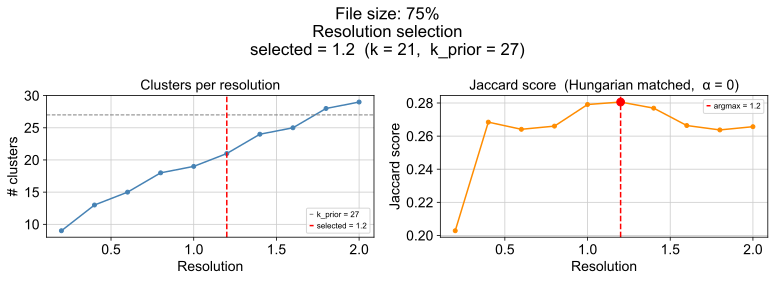
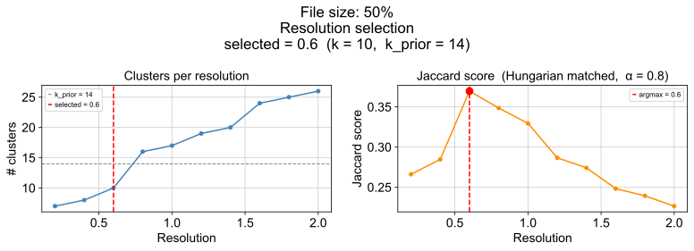
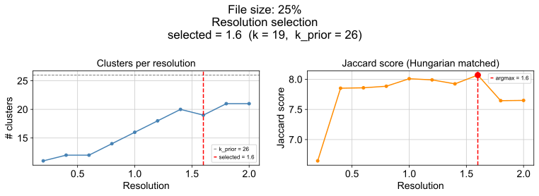

# 0. Report summary

This report documents the cluster label optimisation pipeline applied to three lung datasets drawn from the scBaseCount human scRNA-seq collection (snapshot: 2026-01-12), sampled at the 75th, 50th, and 25th percentile of file size to probe how the method behaves across different dataset scales.

The goal is to identify the Leiden resolution whose partition best recovers the `cell_type` weak prior, then to reduce over-clustering by merging transcriptomically indistinguishable clusters using a random forest. The selection criterion is **Jaccard-based matching via the Hungarian algorithm**.

The pipeline is run independently on each dataset (`FILE_IDX` 0, 1, 2) from `data/scbasecount/2026-01-12/h5ad/GeneFull/Homo_sapiens`. After cell-type rare-type filtering, QC, and preprocessing, Leiden clustering is swept across ten resolutions (0.2–2.0). The resolution with the highest penalised Jaccard score is selected, and a random forest merging step collapses clusters that the classifier cannot distinguish.

Filtering is not discussed in this report but can be seen in `clust_val_analysis.ipynb`.

---

# 1. Resolution selection

## 2.1 Leiden sweep

Leiden clustering (igraph flavour) is run at ten resolutions: 0.2, 0.4, 0.6, 0.8, 1.0, 1.2, 1.4, 1.6, 1.8, and 2.0. Each partition is stored as a separate `obs` column (`leiden_{r}`). The number of clusters grows roughly monotonically with resolution.

## 3.2 Jaccard matrix construction and Hungarian scoring

For each resolution, the quality of the partition is assessed relative to the `cell_type` prior using the following procedure:

1. Build a contingency table between the Leiden clusters and the reference cell types.
2. Convert each cell of the contingency table to an IoU (Jaccard) value: `J[i,j] = intersection / union` between cluster *i* and cell type *j*.
3. Find the optimal one-to-one assignment between clusters and cell types using the Hungarian algorithm (`scipy.optimize.linear_sum_assignment` on `-J`).
4. Compute the penalised score:

```
score = sum(J[matched pairs]) / (k_prior + α × max(0, k − k_prior))
```

where `k` is the number of clusters at the current resolution and `α = OVERCLUSTERING_PENALTY = 0.8`. When the partition has more clusters than cell types, the denominator grows, penalising over-clustering. When `k ≤ k_prior`, the denominator is simply `k_prior`.

The resolution that maximises this score is selected as `SELECTED_RESOLUTION`. The selected partition and its relationship to the `cell_type` reference can be seen as the first panel of the 3-panel UMAPs in §5.2.






---

# 5. RF-based cluster merging

## 5.1 Confusion-based merging

Even at the best resolution, some clusters may be transcriptomically indistinguishable — they share similar gene-expression profiles and only separate due to resolution artefacts. A `RandomForestClassifier` trained on HVG expression with stratified K-fold out-of-fold (OOF) CV identifies these pairs: if the row-normalised OOF confusion between two clusters exceeds `MERGE_THRESHOLD = 0.30`, they are candidates for merging.

A union-find structure propagates merges transitively: if cluster A is confused with B and B is confused with C, all three collapse into a single cluster. This step is optional — if the selected partition already aligns well with `k_prior`, no merges may occur.

**75% dataset (file0)**


**50% dataset (file1)**


**25% dataset (file2)**


## 5.2 Final partition

The merged partition (`leiden_merged`) is compared to both the original selected Leiden partition and the `cell_type` reference in the three-panel UMAPs below. The composition bar charts show the relative cell proportions across merged clusters and cell types, confirming whether the merge has moved the partition closer to the biological groupings.

**75% dataset (file0)**


**50% dataset (file1)**


**25% dataset (file2)**


---

# Appendix: Key parameters

| Parameter              | Value                               | Description                                            |
| ---------------------- | ----------------------------------- | ------------------------------------------------------ |
| `FILE_SIZE`            | `{0: "75%", 1: "50%", 2: "25%"}`   | Dataset size quantile label for each `FILE_IDX`        |
| `MIN_CELLS_PER_TYPE`   | 20                                  | Minimum cells per `cell_type` label to retain          |
| `N_TOP_GENES`          | 2000                                | Number of highly variable genes selected               |
| `N_PCS`                | 40                                  | PCs used for neighbour graph construction              |
| `RESOLUTIONS`          | 0.2, 0.4, …, 2.0 (step 0.2)        | Leiden resolutions swept                               |
| `OVERCLUSTERING_PENALTY` (α) | 0.8                           | Penalty weight for `k > k_prior` in Jaccard denominator |
| `MERGE_THRESHOLD`      | 0.30                                | OOF confusion threshold above which clusters are merged |
