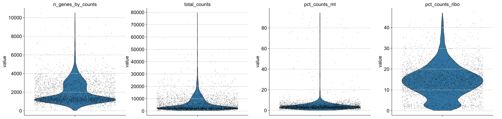
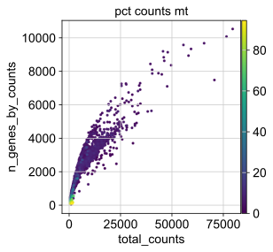
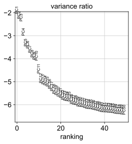
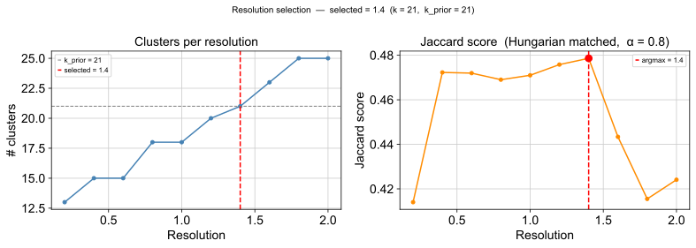
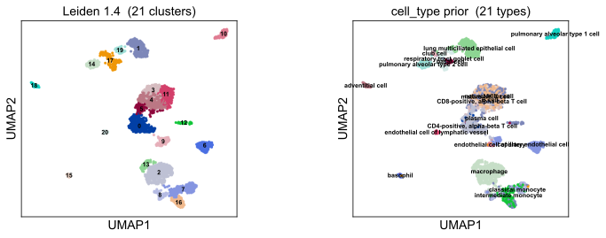
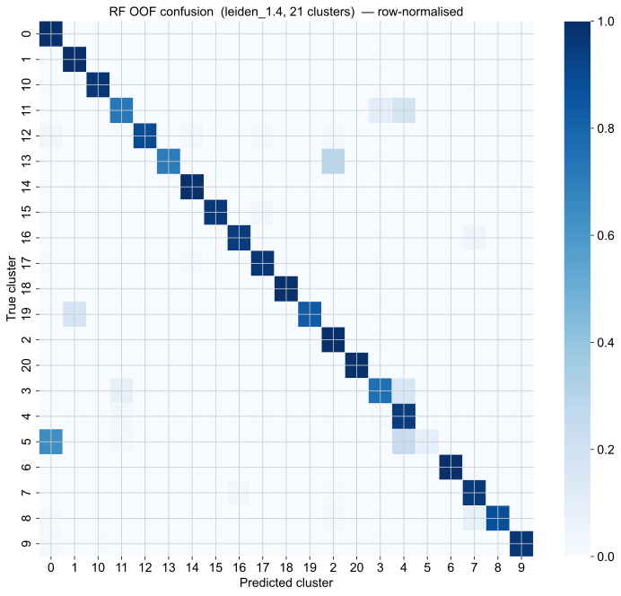
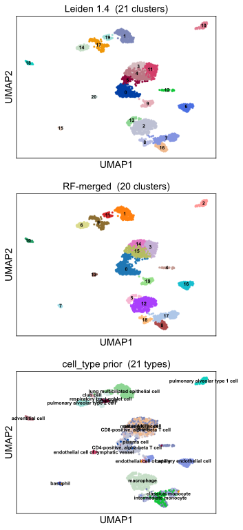
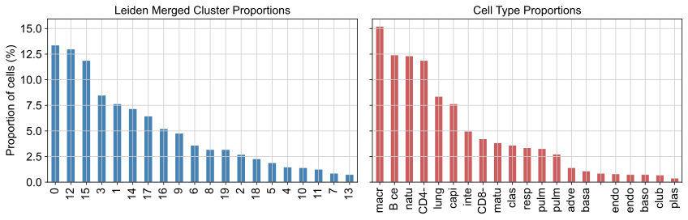

# 0. Report summary

This report documents the cluster label optimisation pipeline applied to a single lung dataset drawn from the scBaseCount human scRNA-seq collection (snapshot: 2026-01-12).

The goal is to identify the Leiden resolution whose partition best recovers the `cell_type` weak prior, then optionally reduce over-clustering by merging transcriptomically indistinguishable clusters using a random forest. The selection criterion is **Jaccard-based matching via the Hungarian algorithm** — not NMI or silhouette, despite what the original notebook intro stated (now corrected).

The pipeline runs on dataset index 2 (`FILE_IDX = 2`) from `data/scbasecount/2026-01-12/h5ad/GeneFull/Homo_sapiens`. After cell-type rare-type filtering, QC, and preprocessing, Leiden clustering is swept across ten resolutions (0.2–2.0). The resolution with the highest penalised Jaccard score is selected, and an optional random forest merging step collapses clusters that the classifier cannot distinguish.

---

# 1. Dataset and QC

## 1.1 Dataset

The dataset is the third file (zero-indexed) in the sorted glob of `.h5ad` files under `data/scbasecount/2026-01-12/h5ad/GeneFull/Homo_sapiens`.

Before any QC, cells whose `cell_type` label appears fewer than `MIN_CELLS_PER_TYPE` (20) times are dropped. This keeps the prior reliable by ensuring every reference category is backed by a meaningful number of observations. The number of remaining cell types defines `k_prior`, the reference cluster count used throughout the scoring and merging steps.

## 1.2 QC filtering

Standard Scanpy QC metrics are computed using mitochondrial (`MT-` prefix) and ribosomal (`RPS*` / `RPL*`) gene flags. Three filters are applied in sequence:

| Filter | Threshold | Rationale |
| ----------------------- | --------- | ------------------------------------------- |
| Minimum genes per cell  | ≥ 200     | Remove empty droplets and low-quality cells |
| Minimum cells per gene  | ≥ 3       | Remove genes with near-zero detection       |
| MT% per cell            | < 20 %    | Remove damaged / apoptotic cells            |

After filtering, 3,333 cells and 22,854 genes remain.





---

# 2. Preprocessing and embedding

## 2.1 Feature selection

Raw counts are preserved in `adata.layers["counts"]` before normalisation. Library-size normalisation (`sc.pp.normalize_total`) followed by log1p transformation is applied to the main matrix. The top 2,000 highly variable genes (`N_TOP_GENES = 2000`) are selected using Scanpy's default `seurat` flavour.


## 2.2 Dimensionality reduction

PCA is computed on the HVG subset. The variance ratio plot is inspected to choose the number of PCs; `N_PCS = 40` is used for neighbour graph construction. UMAP is computed on the resulting kNN graph and used for all subsequent visualisations.



---

# 3. Resolution selection

## 3.1 Leiden sweep

Leiden clustering (igraph flavour) is run at ten resolutions: 0.2, 0.4, 0.6, 0.8, 1.0, 1.2, 1.4, 1.6, 1.8, and 2.0. Each partition is stored as a separate `obs` column (`leiden_{r}`). The number of clusters grows roughly monotonically with resolution.

## 3.2 Jaccard / Hungarian scoring

For each resolution, the quality of the partition is assessed relative to the `cell_type` prior using the following procedure:

1. Build a contingency table between the Leiden clusters and the reference cell types.
2. Convert each cell of the contingency table to an IoU (Jaccard) value: `J[i,j] = intersection / union` between cluster *i* and cell type *j*.
3. Find the optimal one-to-one assignment between clusters and cell types using the Hungarian algorithm (`scipy.optimize.linear_sum_assignment` on `-J`).
4. Compute the penalised score:

```
score = sum(J[matched pairs]) / (k_prior + α × max(0, k − k_prior))
```

where `k` is the number of clusters at the current resolution and `α = OVERCLUSTERING_PENALTY = 0.8`. When the partition has more clusters than cell types, the denominator grows, penalising over-clustering. When `k ≤ k_prior`, the denominator is simply `k_prior`.

The resolution that maximises this score is selected as `SELECTED_RESOLUTION`.

**Note:** NMI and silhouette are not used in this pipeline. The notebook's original intro cell incorrectly described the criterion as a "geometric mean of NMI and normalised silhouette"; this has been corrected to reflect the Jaccard / Hungarian implementation above.



---

# 4. Selected partition

The UMAP below shows the selected Leiden partition alongside the `cell_type` reference labels. Good resolution selection produces clusters that map cleanly to individual cell types with minimal fragmentation or merging.



---

# 5. RF-based cluster merging

## 5.1 Confusion-based merging

Even at the best resolution, some clusters may be transcriptomically indistinguishable — they share similar gene-expression profiles and only separate due to resolution artefacts. A `RandomForestClassifier` trained on HVG expression with stratified K-fold out-of-fold (OOF) CV identifies these pairs: if the row-normalised OOF confusion between two clusters exceeds `MERGE_THRESHOLD = 0.30`, they are candidates for merging.

A union-find structure propagates merges transitively: if cluster A is confused with B and B is confused with C, all three collapse into a single cluster. This step is optional — if the selected partition already aligns well with `k_prior`, no merges may occur.



## 5.2 Final partition

The merged partition (`leiden_merged`) is compared to both the original selected Leiden partition and the `cell_type` reference in the three-panel UMAP below. The composition bar charts show the relative cell proportions across merged clusters and cell types, confirming whether the merge has moved the partition closer to the biological groupings.





---

# Appendix: Key parameters

| Parameter              | Value                               | Description                                            |
| ---------------------- | ----------------------------------- | ------------------------------------------------------ |
| `FILE_IDX`             | 2                                   | Index into sorted glob of `.h5ad` files                |
| `MIN_CELLS_PER_TYPE`   | 20                                  | Minimum cells per `cell_type` label to retain          |
| `N_TOP_GENES`          | 2000                                | Number of highly variable genes selected               |
| `N_PCS`                | 40                                  | PCs used for neighbour graph construction              |
| `RESOLUTIONS`          | 0.2, 0.4, …, 2.0 (step 0.2)        | Leiden resolutions swept                               |
| `OVERCLUSTERING_PENALTY` (α) | 0.8                           | Penalty weight for `k > k_prior` in Jaccard denominator |
| `MERGE_THRESHOLD`      | 0.30                                | OOF confusion threshold above which clusters are merged |
