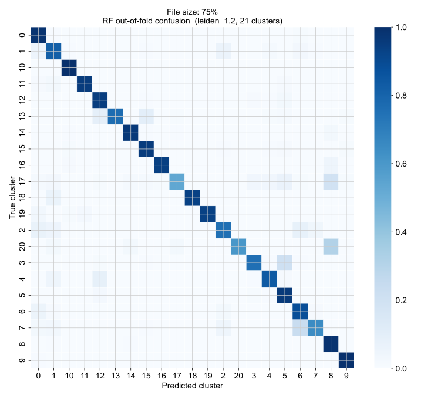
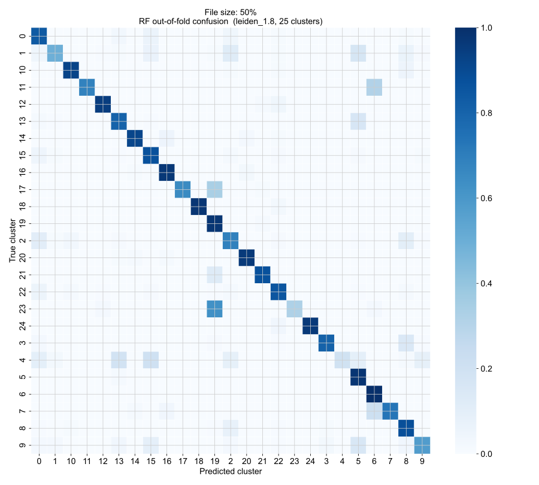
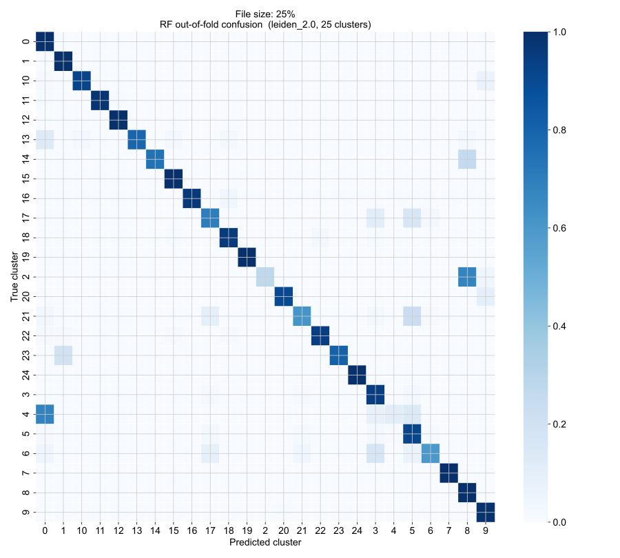
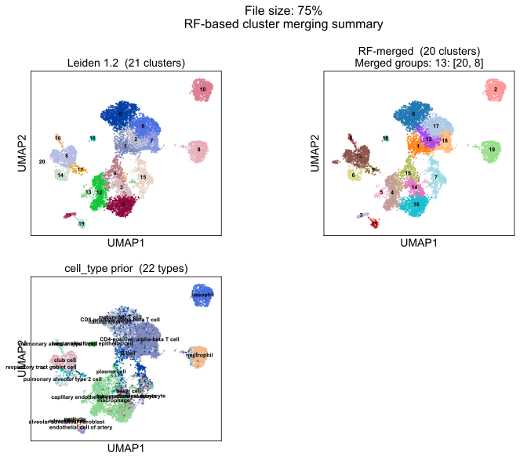
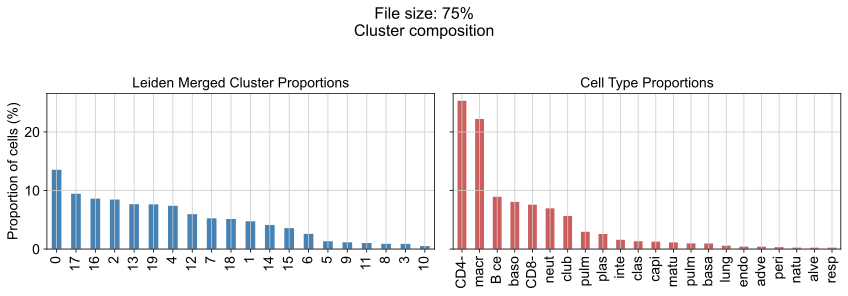
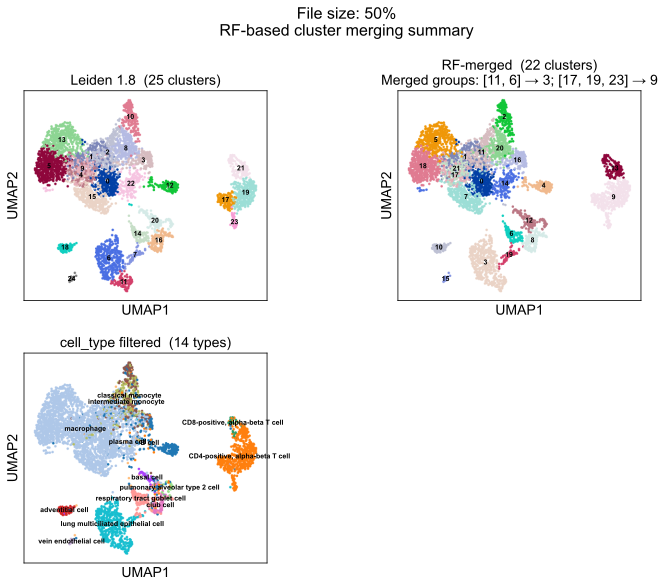
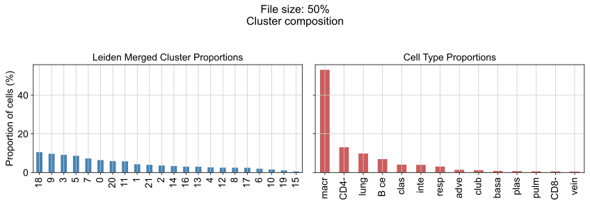
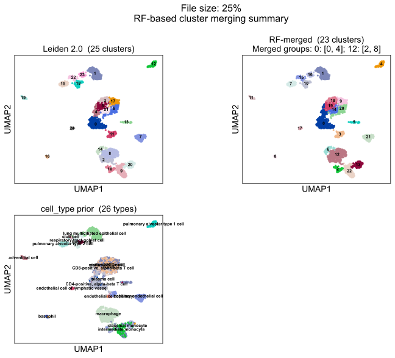
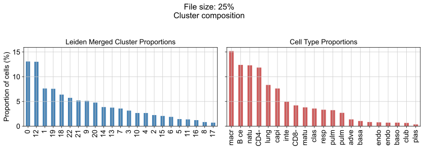

# 0. Report summary

This report documents the cluster label optimisation pipeline applied to three lung datasets drawn from the scBaseCount human scRNA-seq collection (snapshot: 2026-01-12), sampled at the 75th, 50th, and 25th percentile of number of cells to probe how the method behaves across different dataset scales.

**Datasets**


| SRX         | *n* cells post filter | *n* cells percentile (%) |
| ----------- | --------------------- | ------------------------ |
| SRX22996378 | 3,333                 | 25                       |
| SRX17412841 | 4,757                 | 50                       |
| SRX13198730 | 8,972                 | 75                       |


The goal is to identify the Leiden resolution whose partition best recovers the `cell_type` weak prior, then to reduce over-clustering by merging transcriptomically indistinguishable clusters using a random forest. The selection criterion is **Jaccard-based matching via the Hungarian algorithm**.

The pipeline is run independently on each dataset (`FILE_IDX` 0, 1, 2) from `data/scbasecount/2026-01-12/h5ad/GeneFull/Homo_sapiens`. After cell-type rare-type filtering, QC, and preprocessing, Leiden clustering is swept across ten resolutions (0.2–2.0). The resolution with the highest penalised Jaccard score is selected, and a random forest merging step collapses clusters that the classifier cannot distinguish.

Filtering is not discussed in this report but all the filtering and QC steps are outlined in `clust_val_analysis.ipynb`.

---

# 1. Deliverables

The deliverables I set out to ship were
- Build a clustering pipeline for a few sample datasets
    - Simple scanpy pipeline built in `clust_val_analysis.ipynb`, derisked for 3 datasets
- Develop a biologically informed method to optimize clustering resolutions
    - Method was developed. See §2.
- Do not use a composite index
    - I do not consider the Jaccard index a composite index.

See §Appendix for a breakdown on the parameters I used.

---

# 2. Methods at a glance

- Sweep Leiden resolution (0.2–2.0) to generate a range of candidate partitions
- Build a Jaccard similarity matrix between each predicted cluster and every reference cell type
- Apply the Hungarian algorithm to find the jointly optimal one-to-one assignment between clusters and reference types that maximises the total summed Jaccard across all matched pairs
- Scale the summed Jaccard score by a denominator that grows when predicted cluster count exceeds the reference type count, penalising excessove over-clustering
- Train a `RandomForestClassifier` on per-cell HVG expression profiles labelled by cluster; merge pairs whose out-of-fold confusion exceeds a fixed threshold

---

# 3. Resolution selection

## 3.1 Leiden sweep

Leiden clustering (igraph flavour) is run at ten resolutions: 0.2, 0.4, 0.6, 0.8, 1.0, 1.2, 1.4, 1.6, 1.8, and 2.0. Each partition is stored as a separate `obs` column (`leiden_{r}`). The number of clusters grows roughly monotonically with resolution.

## 3.2 Jaccard matrix construction and Hungarian scoring

For each resolution, the quality of the partition is assessed relative to the `cell_type` prior using the following procedure:

1. Build a contingency table between the Leiden clusters and the reference cell types.
*The contingency table is made up of (n unique clusters) rows and (n unique cell types) columns. It starts out populated with 0's, and a 1 is added for each cell in the anndata object*
2. Convert each cell of the contingency table to an IoU (Jaccard) value: `J[i,j] = intersection / union` between cluster *i* and cell type *j*.
*This converts raw overlap counts into a size-corrected similarity, preventing large clusters from scoring highly simply by virtue of containing more cells.*
3. Find the optimal one-to-one assignment between clusters and cell types using the Hungarian algorithm (`scipy.optimize.linear_sum_assignment` on `-J`).
*Since the Hungarian algorithm minimizes the cost over a matrix, and since the matrix `J` has higher values where cluster overlap is higher, the matrix needs to be made negative (`-J`) before optimization can be applied*
4. Compute the penalised score:

```
score = sum(J[matched pairs]) / (k_prior + α × max(0, k − k_prior))
```

where `k` is the number of clusters at the current resolution and `α = OVERCLUSTERING_PENALTY = 0.8`. When the partition has more clusters than cell types, the denominator grows, penalising over-clustering. When `k ≤ k_prior`, the denominator is simply `k_prior`.

There is no explicit underclustering penalty. When `k < k_prior`, the Hungarian algorithm can match at most `k` reference types, leaving `k_prior − k` types unmatched with a Jaccard contribution of zero. The denominator remains `k_prior`, so the score is naturally suppressed by the smaller numerator. Thus, underclustering is penalised implicitly.

The resolution that maximises this score is selected as `SELECTED_RESOLUTION`. The selected partition and its relationship to the `cell_type` reference can be seen as the first panel of the 3-panel UMAPs in §5.2.

---

# 4. RF-based cluster merging

## 4.1 Confusion-based merging

Even at the best resolution, some clusters may be transcriptomically indistinguishable. In other words, they may share similar gene-expression profiles and only separate due to resolution artifacts. A `RandomForestClassifier` trained on HVG expression with stratified K-fold out-of-fold (OOF) CV identifies these pairs: if the row-normalised OOF confusion between two clusters exceeds `MERGE_THRESHOLD = 0.30`, they are candidates for merging.

A union-find structure propagates merges transitively: if cluster A is confused with B and B is confused with C, all three collapse into a single cluster.

**75% dataset (file0)**


**50% dataset (file1)**


**25% dataset (file2)**


## 5.2 Final partition

The merged partition (`leiden_merged`) is compared to both the original selected Leiden partition and the `cell_type` reference in the three-panel UMAPs below. The composition bar charts show the relative cell proportions across merged clusters and cell types, confirming whether the merge has moved the partition closer to the biological groupings.

**75% dataset (file0)**



**50% dataset (file1)**



**25% dataset (file2)**



---

# Appendix: Key parameters


| Parameter                    | Value                            | Description                                             |
| ---------------------------- | -------------------------------- | ------------------------------------------------------- |
| `FILE_SIZE`                  | `{0: "75%", 1: "50%", 2: "25%"}` | Dataset size quantile label for each `FILE_IDX`         |
| `MIN_CELLS_PER_TYPE`         | 20                               | Minimum cells per `cell_type` label to retain           |
| `N_TOP_GENES`                | 2000                             | Number of highly variable genes selected                |
| `N_PCS`                      | 40                               | PCs used for neighbour graph construction               |
| `RESOLUTIONS`                | 0.2, 0.4, …, 2.0 (step 0.2)      | Leiden resolutions swept                                |
| `OVERCLUSTERING_PENALTY` (α) | 0.8                              | Penalty weight for `k > k_prior` in Jaccard denominator. For this data I found that this parameter was necessary |
| `MERGE_THRESHOLD`            | 0.30                             | OOF confusion threshold above which clusters are merged |


