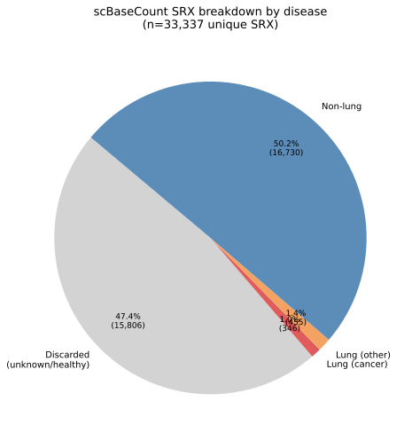
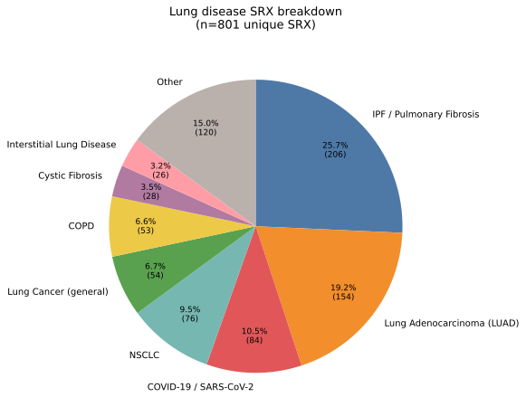
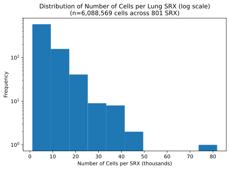

# V2 Metadata Analysis

## Rationale for starting a new metadata analysis

On 2026-03-26, Parashar and Oliver decided that the previous approach to data collection was unfesable. We had overestimated the value of scBaseCount. We determined it lacks rich enough metadata for our previous goals.

# 0. Report summary

This report characterises the lung-related subset of the scBaseCount human single-cell RNA-seq metadata catalogue (snapshot: 2026-01-12).

It follows Parashar and Oliver's decision to change approaches relating to data curation (see `README.md`)

Samples with fewer than 1,000 cells are excluded up front. Of the remaining 33,337 unique SRX accessions, 15,806 (47.4%) are discarded as healthy or unknown. The remaining 17,531 known samples are filtered with lung-specific regex patterns applied to both the `disease` and `tissue` fields. 7,484 samples match at least one lung-related label (**lung union**); 801 pass the stricter requirement that *both* fields are lung-related (**lung intersection**), which is the primary analysis set.

Within the 801-sample intersection, 346 (43.2%) involve a cancer diagnosis. The dominant disease categories are IPF / Pulmonary Fibrosis, Lung Adenocarcinoma, COVID-19 / SARS-CoV-2, and NSCLC. These 801 samples contain approximately 6.1 million cells in total, with a right-skewed distribution (mean 7,601 / median 5,506 cells per SRX).

---

# 1. Sample overview

## 1.1 Samples by disease

Samples with fewer than 1,000 cells are excluded up front. The remaining samples are then filtered to those with **known, non-healthy labels** in both the `disease` and `tissue` fields (i.e. entries labelled normal, healthy, control, unknown, etc. are discarded). The remaining samples are split based on whether both the disease *and* tissue label are lung-related (**lung intersection**, 801 SRX) or either one is (**lung union**, 7,484 SRX). The intersection is the primary analysis set.

| Stage                                                           | *n* SRX | Notes                                          |
| --------------------------------------------------------------- | ------- | ---------------------------------------------- |
| Total unique SRX                                                | 35,266  | Raw dataset                                    |
| Remaining (≥ 1,000 cells)                                       | 33,337  | After min-cell filter (5.5 % of SRX discarded) |
| Healthy / unknown (discarded)                                   | 15,806  | Matched by `NORMAL_HEALTHY_REGEX` (47.4 %)     |
| Known, non-healthy (`sample_known`)                             | 17,531  | Remainder after discarding                     |
| Lung union (disease **or** tissue is lung-related)              | 7,484   | At least one lung-related label                |
| **Lung intersection** (disease **and** tissue are lung-related) | **801** | Primary analysis set                           |
| └─ Cancer subset                                                | 346     | 43.2 % of intersection                         |
| Not in lung intersection                                        | 16,730  | Non-lung known samples (see §2.3)              |

Of the 35,266 total unique SRX accessions, 1,929 (5.5%) are dropped for having fewer than 1,000 cells. Of the remaining 33,337, 15,806 (47.4%) are discarded as healthy/unknown. Of the remaining known samples, 801 carry a lung-specific disease *and* tissue label, 346 of which (43.2%) involve a cancer diagnosis. The broader lung union (either label is lung-related) contains 7,484 samples, but the stricter intersection is used as the primary analysis set.

## 1.2 Regex at a glance

Four regular expressions drive the filtering pipeline (all case-insensitive):

| Name                   | Purpose                                        | Key terms matched                                                                              |
| ---------------------- | ---------------------------------------------- | ---------------------------------------------------------------------------------------------- |
| `NORMAL_HEALTHY_REGEX` | Discard healthy / control samples              | `normal`, `healthy`, `control`, `unknown`, `wild-type`, `baseline`, …                          |
| `LUNG_DISEASE_RE`      | Keep samples with a lung-related disease label | `lung`, `pulmonary`, `NSCLC`, `SCLC`, `fibrosis`, `COPD`, `COVID-19`, `cancer`, `carcinoma`, … |
| `LUNG_TISSUE_RE`       | Keep samples with a lung-related tissue label  | `lung`, `pulmonary`, `alveol`*, `bronch`*, `pleura`, `trachea`, `parenchyma`, …                |
| `CANCER_RE`            | Flag samples as cancer vs. non-cancer          | `cancer`, `carcinoma`, `tumour`, `malignant`, `NSCLC`, `SCLC`, `mesothelioma`, …               |

---

# 2. Lung disease breakdown

## 2.1 Raw label breakdown

### 2.1.1 Top excluded labels

The 17,692 samples in `sample_known` that did **not** pass the lung-intersection filter (i.e. they lacked a lung-specific disease label, a lung-specific tissue label, or both). The tables below show the most common free-text labels in that excluded set, confirming the filter is working as expected.

Notice that there are a good number of COVID-19 disease labeled data that get discarded due to tissue filtering. These are likely not labeled `lung` or similar in the tissue field. 

**Top 10 disease labels (excluded)**

| Disease label                | % of excluded samples |
| ---------------------------- | --------------------- |
| chronic myelogenous leukemia | 4.72                  |
| acute T cell leukemia        | 2.47                  |
| COVID-19                     | 2.33                  |
| Chronic Myelogenous Leukemia | 1.64                  |
| other                        | 1.60                  |
| *(blank)*                    | 1.31                  |
| multiple myeloma             | 1.08                  |
| breast cancer                | 0.95                  |
| glioblastoma                 | 0.93                  |
| melanoma                     | 0.88                  |

**Top 10 tissue labels (excluded)**

| Tissue label                              | % of excluded samples |
| ----------------------------------------- | --------------------- |
| CML                                       | 4.53                  |
| blood                                     | 4.21                  |
| K562 cell line                            | 3.45                  |
| bone marrow                               | 3.18                  |
| acute T cell leukemia                     | 2.19                  |
| Peripheral Blood Mononuclear Cells (PBMC) | 2.00                  |
| peripheral blood                          | 1.75                  |
| liver                                     | 1.46                  |
| skin                                      | 1.41                  |
| breast                                    | 1.39                  |

### 2.1.2 Top lung labels

The tables below show the top 10 free-text labels exactly as they appear in the dataset, before any normalisation is applied.

**Top 10 tissue labels**

| Tissue label                 | % of samples |
| ---------------------------- | ------------ |
| lung                         | 52.43        |
| lung tumor                   | 3.12         |
| lung tumour                  | 1.62         |
| lung adenocarcinoma          | 1.37         |
| lung tissue                  | 1.25         |
| lung tumor central margin    | 1.12         |
| lung (primary basal cells)   | 1.12         |
| lung biopsy                  | 1.12         |
| lung tumor subpleural margin | 1.00         |
| parietal pleura              | 0.75         |

**Top 10 disease labels**

| Disease label                       | % of samples |
| ----------------------------------- | ------------ |
| lung adenocarcinoma                 | 13.48        |
| idiopathic pulmonary fibrosis (IPF) | 8.74         |
| Idiopathic Pulmonary Fibrosis (IPF) | 7.87         |
| SARS-CoV-2 infection                | 4.87         |
| idiopathic pulmonary fibrosis       | 3.75         |
| COPD                                | 2.87         |
| non-small cell lung cancer (NSCLC)  | 2.75         |
| lung adenocarcinoma (LUAD)          | 2.75         |
| pulmonary fibrosis                  | 2.62         |
| carcinoma non-small cell            | 2.00         |

## 2.2 Normalised disease breakdown

The table below shows the regex rules used to map free-text disease labels into broad categories. Rules are applied in order — the first match wins. Labels that match none of the rules are placed in **Other**.

| Category                     | Pattern                               |
| ---------------------------- | ------------------------------------- |
| IPF / Pulmonary Fibrosis     | `pulmonary fibrosis`                  |
| COVID-19 / SARS-CoV-2        | `COVID`                               |
| Lung Adenocarcinoma (LUAD)   | `lung adenocarcinoma`                 |
| NSCLC                        | `NSCLC`                               |
| Lung Squamous Cell Carcinoma | `squamous cell carcinoma of the lung` |
| COPD                         | `\bCOPD\b`                            |
| Lung Cancer (general)        | `lung cancer`                         |
| Cystic Fibrosis              | `cystic fibrosis`                     |
| Interstitial Lung Disease    | `interstitial lung`                   |

Within the 801 lung-intersection samples, free-text disease labels are normalised into broad categories via regex. Categories representing < 2% are collapsed into **Other**. IPF / Pulmonary Fibrosis and Lung Adenocarcinoma together account for roughly 40% of the set.

---

# 3. Cell count distribution

The 801 lung-intersection SRX samples contain ~6.1M cells in total (mean 7,601 / median 5,506 per SRX). The distribution is right-skewed, with most samples in the 3,000–9,000 cell range and a small number of outliers above 40,000. The minimum is 1,082 cells per SRX (reflecting the ≥ 1,000-cell pre-filter) and the maximum is 81,811.

---

# 4. Appendix

## Top lung union labels

The 7,484 samples in the **lung union** (disease *or* tissue is lung-related). Because the union casts a wider net, many non-lung diseases appear, the disease column reflects whatever was annotated regardless of whether the tissue label is lung-specific.

**Top 10 tissue labels (union)**

| Tissue label                               | % of union samples |
| ------------------------------------------ | ------------------ |
| lung                                       | 6.49               |
| blood                                      | 3.62               |
| breast                                     | 2.62               |
| Peripheral Blood Mononuclear Cells (PBMC)  | 2.32               |
| liver                                      | 1.92               |
| Peripheral blood mononuclear cells (PBMCs) | 1.78               |
| peripheral blood mononuclear cells         | 1.67               |
| blood monocyte                             | 1.47               |
| brain                                      | 1.44               |
| esophageal carcinoma                       | 1.39               |

**Top 10 disease labels (union)**

| Disease label                       | % of union samples |
| ----------------------------------- | ------------------ |
| COVID-19                            | 5.38               |
| breast cancer                       | 2.12               |
| Crohn's disease                     | 1.86               |
| lung adenocarcinoma                 | 1.55               |
| colorectal cancer                   | 1.46               |
| high-grade serous ovarian cancer    | 1.40               |
| cardiovascular disease risk factors | 1.23               |
| hepatocellular carcinoma            | 1.16               |
| Hepatocellular carcinoma            | 1.12               |
| Alzheimer's Disease                 | 1.08               |

