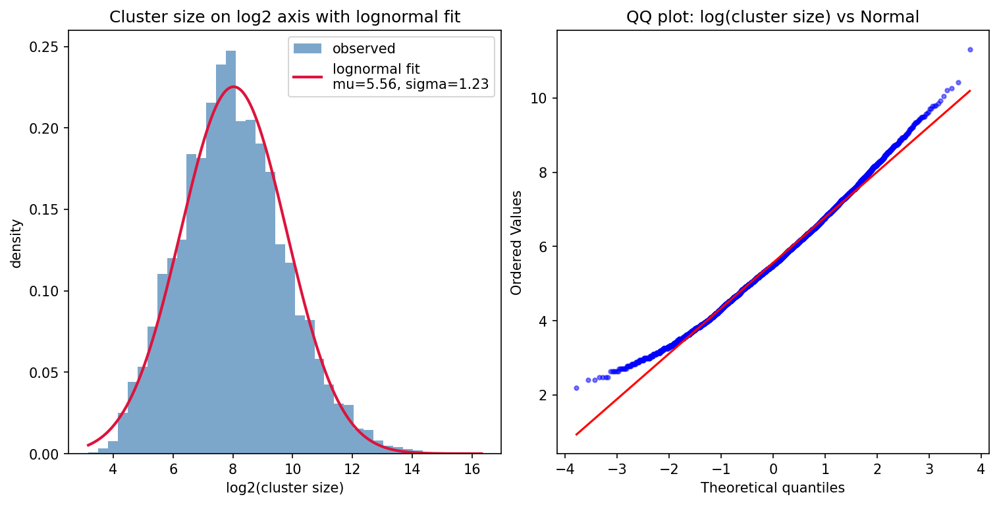
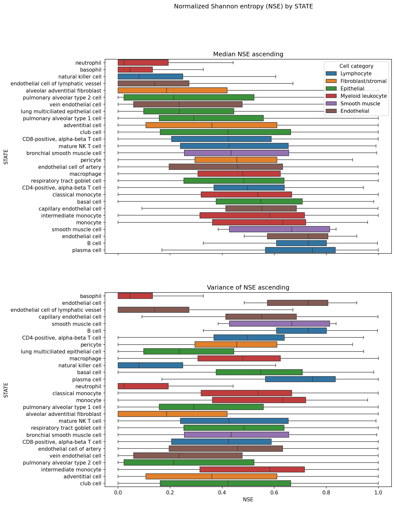

# STATE vs leiden clustering assessment

Exploratory analysis on `STATE x leiden_cluster` matrices produced by [`pipelines/cluster_stats.py`](../../../pipelines/cluster_stats.py), run `cluster_stats/clustered_20260509`. Source matrices live in [`output/cluster_stats/clustered_20260509/cluster_stats.json`](../../../output/cluster_stats/clustered_20260509/cluster_stats.json).

Leiden clusters from the clustering pipeline are passed to CyteType for annotation. STATE labels are treated as weak priors during clustering, informing the clustering resolution selection process. The goal here is to flag cell types whose STATE labels overlap poorly with leiden clusters, since those are the ones most likely to disagree with CyteType.

Analysis script: [state_vs_leiden.py](state_vs_leiden.py).

## Figures

<!-- Lognormal fit of leiden cluster sizes pooled across accessions, plus the KS goodness-of-fit statistic.

 -->

KDE of STATE-mixing NSE within each cluster, split by log2(cluster size) quartile, with a one-way ANOVA across quartiles.

NSE against log2(group size) for STATEs (left) and leiden clusters (right) with linear and LOWESS fits and Spearman rho.

Distribution of `nse_STATE` conditioned on the NSE tertile of the leiden cluster it appears in.

<!-- 

Per-STATE share of cells and clusters that fall in low, mid, and high NSE leiden tertiles. STATEs sorted by share of cells in the low tertile. -->

<!-- 

Per-STATE distribution of `nse_STATE` across accessions, sorted by median (top) and variance (bottom), colored by cell category. -->

