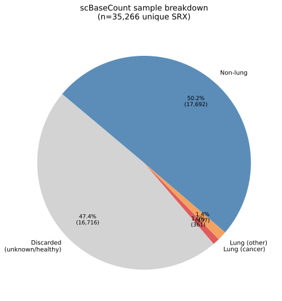
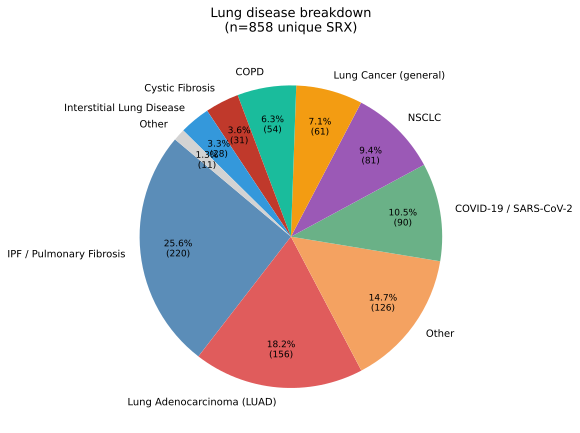
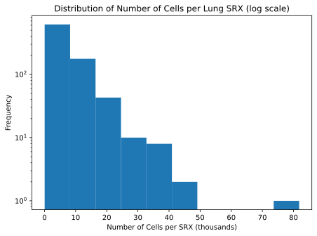

# Lung Metadata Analysis Report

**Dataset:** scBaseCount 2026-01-12 · Homo sapiens · `GeneFull`

---

## 1. Sample overview

Samples are filtered to those with **known, non-healthy labels** in both the `disease` and `tissue` fields (i.e. entries labelled normal, healthy, control, unknown, etc. are discarded). The remaining samples are split based on whether both the disease *and* tissue label are lung-related (**lung intersection**, 858 SRX) or either one is (**lung union**, 7,986 SRX). The intersection is the primary analysis set.

Of the 35,266 total unique SRX accessions, 16,716 (47.4%) are discarded as healthy/unknown. Of the remaining known samples, 858 carry a lung-specific disease *and* tissue label — 361 of which (42.1%) involve a cancer diagnosis.

<!--  -->

---

## 2. Lung disease breakdown

Within the 858 lung-intersection samples, free-text disease labels are normalised into broad categories via regex. Categories representing < 2% are collapsed into **Other**. IPF / Pulmonary Fibrosis and Lung Adenocarcinoma together account for roughly 40% of the set.

---

## 3. Cell count distribution

The 858 lung-intersection SRX samples contain ~6.1M cells in total (mean 7,126 / median 5,125 per SRX). The distribution is right-skewed, with most samples in the 3,000–9,000 cell range and a small number of outliers above 40,000.

