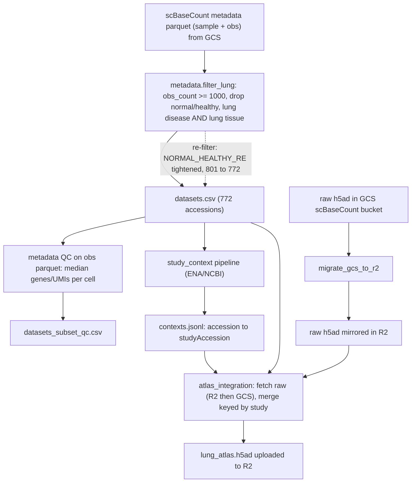

# atlas_integration

Builds a merged lung atlas from scBaseCount h5ad files, attaches study-level batch keys from `contexts.jsonl`, runs uniform preprocessing, applies Harmony batch correction on `study`, clusters the integrated object, and writes integration metrics.

## Curation provenance

The atlas cohort is not the raw scBaseCount catalog. Each accession in `output/atlas/data/lung_atlas.h5ad` passes through the steps below before merge.



Artifacts along this path:

| Step | Code | Output |
|------|------|--------|
| Metadata filter | `scripts/metadata/filter.py` | `output/metadata/datasets.csv` |
| Re-filter (801 to 772) | `scripts/metadata/regexes.py` (`NORMAL_HEALTHY_RE` tightened) | same CSV, 29 accessions removed |
| Per-cell QC table | `scripts/metadata/qc.py` | `output/metadata/datasets_subset_qc.csv` |
| Study context | `scripts/study_context/` | `output/context/contexts.jsonl` |
| Raw h5ad mirror | `pipelines/migrate_gcs_to_r2.py` | R2 raw prefix |
| Atlas merge + integration | `scripts/atlas_integration/` | `output/atlas/data/lung_atlas.h5ad` |

## Usage

```python
from pathlib import Path

from atlas_integration import AtlasIntegrationConfig, run_atlas_integration

cfg = AtlasIntegrationConfig(
    datasetsCsvPath=Path("output/metadata/datasets.csv"),
    contextsPath=Path("output/context/contexts.jsonl"),
    localH5adRoot=Path("data/scbasecount/2026-01-12/h5ad/GeneFull/Homo_sapiens"),
    outputDir=Path("output/atlas"),
    figsDir=Path("output/atlas/figs"),
    subsampleN=2000,  # optional per-accession cap while prototyping
)

adata, result = run_atlas_integration(cfg)
result.atlasPath
result.batchMixing.meanSameStudyNeighborFractionCorrected
```

Pass a pre-merged AnnData when the runner has already downloaded and concatenated accessions:

```python
from atlas_integration import MergeStats

adata, result = run_atlas_integration(cfg, adata=merged, merge_stats=merge_stats)
```

## Config reference

| Field | Default | Description |
|-------|---------|-------------|
| `datasetsCsvPath` | `output/metadata/datasets.csv` | Accession catalog with `srx_accession` and `file_path` |
| `contextsPath` | `output/context/contexts.jsonl` | Source of `studyAccession` batch keys |
| `batchKey` | `study` | obs column written during merge |
| `cellTypeKey` | `cell_type` | Author label column; missing values become `unknown` |
| `missingLabel` | `unknown` | Fill value for blank or missing `cell_type` |
| `subsampleN` | `None` | Optional per-accession cell cap before concat |
| `leidenResolution` | `1.0` | Resolution for uncorrected and corrected Leiden runs |
| `metricsSampleSize` | `5000` | Subsample size for batch-mixing and silhouette metrics |
| `outputDir` | `output/atlas` | Writes `data/lung_atlas.h5ad` and `run_metadata.json` |
| `figsDir` | `output/atlas/figs` | UMAP PNGs colored by `study` and `cell_type` |

## Outputs

| Path | Description |
|------|-------------|
| `output/atlas/data/lung_atlas.h5ad` | Integrated atlas with uncorrected and corrected embeddings |
| `output/atlas/run_metadata.json` | Merge stats, batch-mixing metrics, cluster-conservation metrics |
| `output/atlas/figs/umap_{study\|cell_type}_{uncorrected\|corrected}.png` | Side-by-side UMAP comparisons |

Key `obs` columns written during merge:

- `accession`: SRX/ERX accession
- `study`: `studyAccession` from `contexts.jsonl` (fallback: accession)
- `cell_type`: author label with missing values filled as `unknown`

Key cluster columns:

- `leiden_uncorrected`: Leiden on uncorrected PCA
- `leiden_atlas`: Leiden after Harmony correction

Key embeddings:

- `X_umap_uncorrected`: UMAP before Harmony
- `X_umap`: UMAP after Harmony
- `X_pca_harmony`: Harmony-corrected PCA basis

## Batch key choice

Harmony uses `studyAccession` (PRJNA/PRJEB), not SRX/ERX. Multiple experiments from the same publication share one batch label. See `writeups/atlas/README.md` for the full justification.
