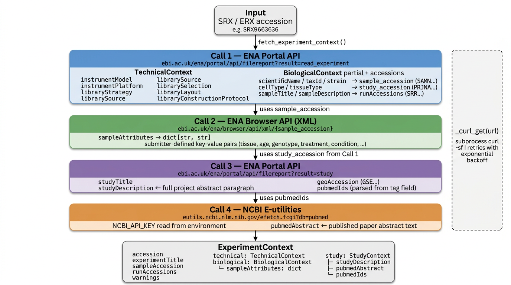

# study_context

Standalone utility that fetches structured experiment context from EBI ENA and NCBI PubMed for a given SRX or ERX accession. Returns a typed Pydantic model ready for downstream use or LLM consumption.

Library selection protocol, study context, and study abstract can be extracted from the output and stored in a json file, from which text strings can be fed into CyteType.

I've generated the file `../output/contexts.jsonl` with `../main.py` at commit `6c01a0b`.

## Usage

```python
from study_context import pipeline_for_accession_list

contexts = pipeline_for_accession_list(accessions)
```

### Accessing fields

```python
ctx.study.studyDescription   # full project abstract from ENA
ctx.study.pubmedAbstract     # published paper abstract from PubMed
ctx.biological.tissueType
ctx.biological.sampleAttributes   # raw submitter key-values (tissue, age, genotype, …)
ctx.technical.libraryConstructionProtocol
ctx.warnings                 # any fetch failures, non-fatal
```

### Serialisation

```python
# save
with open("contexts.jsonl", "w") as f:
    for ctx in contexts:
        f.write(ctx.model_dump_json() + "\n")

# load (no re-fetch needed)
with open("contexts.jsonl") as f:
    contexts = [ExperimentContext.model_validate_json(line) for line in f]
```

## Pipeline



Each accession triggers four sequential API calls:

| Call | Endpoint | Populates |
|------|----------|-----------|
| 1 | ENA Portal API — `filereport?result=read_experiment` | `TechnicalContext`, partial `BiologicalContext`, `sample_accession`, `study_accession`, `runAccessions` |
| 2 | ENA Browser API — `xml/{sample_accession}` | `BiologicalContext.sampleAttributes` (submitter-defined key-value blob) |
| 3 | ENA Portal API — `filereport?result=study` | `StudyContext`: `studyDescription`, `studyTitle`, `geoAccession`, `pubmedIds` |
| 4 | NCBI E-utilities — `efetch?db=pubmed` | `StudyContext.pubmedAbstract` |

`sample_accession` and `study_accession` are discovered automatically from Call. Only the SRX/ERX needs to be provided. All HTTP calls go through `_curl_get`, which uses `curl -sf` via subprocess with exponential-backoff retries (up to 3 attempts).

### Rate limits

- ENA Portal/Browser APIs: 50 req/s
- NCBI E-utilities: 3 req/s without API key, 10 req/s with one

Make a file called `.env` with a line that says

```h
NCBI_API_KEY=your_key_here
```

## Inspecting the output

`metadata_analysis/contexts_inspection.ipynb` is a validation notebook for reviewing the contents of a serialised `contexts.jsonl` file. It covers:

| Section | What it checks |
|---------|----------------|
| **Load & basic counts** | Records loaded vs source CSV; flags missing, extra, or duplicate accessions |
| **Field coverage** | Fill-rate table for key text fields: `studyDescription`, `pubmedAbstract`, `tissueType`, `cellType`, `sampleAttributes`, `libraryStrategy`, `libraryConstructionProtocol` |
| **Warnings** | Count and type breakdown of non-fatal fetch failures; lists affected accessions |
| **Distributions** | Value counts for `libraryStrategy`, `scientificName`, `tissueType` |
| **Spot checks** | Prints a summary of the first 3 records; separately lists all records missing `pubmedAbstract` so they can be investigated or re-fetched |

## Output model

```
ExperimentContext
├── accession               str
├── experimentTitle         str | None
├── sampleAccession         str | None
├── runAccessions           list[str]
├── warnings                list[str]
├── technical: TechnicalContext
│   ├── instrumentModel
│   ├── instrumentPlatform
│   ├── libraryStrategy
│   ├── librarySource
│   ├── librarySelection
│   ├── libraryLayout
│   └── libraryConstructionProtocol
├── biological: BiologicalContext
│   ├── scientificName
│   ├── taxId
│   ├── strain
│   ├── cellType
│   ├── tissueType
│   ├── sampleTitle
│   ├── sampleDescription
│   └── sampleAttributes    dict[str, str]
└── study: StudyContext | None
    ├── studyAccession
    ├── studyTitle
    ├── studyDescription
    ├── geoAccession
    ├── pubmedIds           list[str]
    └── pubmedAbstract      str | None
```
