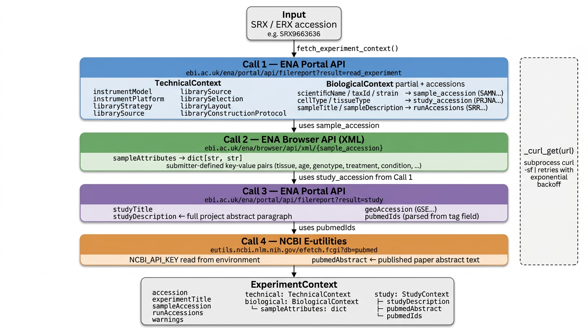

# study_context

Standalone utility that fetches structured experiment context from EBI ENA and NCBI PubMed for a given SRX or ERX accession. Returns a typed Pydantic model ready for downstream use or LLM consumption.

Library selection protocol, study context, and study abstract can be extracted from the output and stored in JSONL, from which text strings can be fed into CyteType.

The canonical cache path is `CONTEXTS_JSONL_PATH` (`output/context/contexts.jsonl`). See `notebooks/pipeline/study_context.ipynb`. Search `New context acquisition run` in `logs/study_context.log` for fetch logs.

One experiment context may be cited in multiple studies. Currently, if an experiment has multiple studies, the accessions of those studies will be sorted and the first one will be selected. That study's abstract will be the one fetched. This is reproducible but could be improved. Future work may look into the possibility of reproducibly getting the most relevant abstract rather than the first. This sorted method was not implemented until after the first CyteType run at Git tag `cytetype_subset_1`, and therefore some CyteType runs may need to be rerun if [`contexts.jsonl`](../../output/context/contexts.jsonl) changes for any of the accessions used on that run.

## Usage

```python
from study_context import CONTEXTS_JSONL_PATH, load_contexts_jsonl, pipeline_for_accession_list

contexts = pipeline_for_accession_list(accessions)
by_accession = load_contexts_jsonl()
```

### Generating a context summary

`experiment_context_summary` takes an `ExperimentContext` and returns a single string joining the available descriptive fields. Useful for feeding context into an LLM prompt.

```python
from study_context import experiment_context_summary

summary = experiment_context_summary(ctx)
# "Tissue: lung. Library strategy: RNA-Seq. Abstract: ..."
```

Fields included (in order, only if populated): tissue type, library strategy, library construction protocol, study description, PubMed abstract.

### Accessing fields

```python
ctx.study.studyDescription   # full project abstract from ENA
ctx.study.pubmedAbstract     # published paper abstract from PubMed
ctx.biological.tissueType
ctx.biological.sampleAttributes   # raw submitter key-values (tissue, age, genotype, …)
ctx.technical.libraryConstructionProtocol
ctx.warnings                 # any fetch failures, non-fatal
```

## Pipeline



Each accession triggers four sequential API calls:

| Call | Endpoint | Populates |
|------|----------|-----------|
| 1 | ENA Portal API — `filereport?result=read_experiment` | `TechnicalContext`, partial `BiologicalContext`, `sample_accession`, `study_accession`, `runAccessions` |
| 2 | ENA Browser API — `xml/{sample_accession}` | `BiologicalContext.sampleAttributes` (submitter-defined key-value blob) |
| 3 | ENA Portal API — `filereport?result=study` | `StudyContext`: `studyDescription`, `studyTitle`, `geoAccession`, `pubmedIds` |
| 4 | NCBI E-utilities — `efetch?db=pubmed` | `StudyContext.pubmedAbstract` |

`sample_accession` and `study_accession` are discovered automatically from Call. Only the SRX/ERX needs to be provided. All HTTP calls go through `_http_get`, which uses a shared `httpx.Client` with exponential-backoff retries (up to 3 attempts).

### Rate limits

- ENA Portal/Browser APIs: 50 req/s
- NCBI E-utilities: 3 req/s without API key, 10 req/s with one

Make a file called `.env` with a line that says

```h
NCBI_API_KEY=your_key_here
```

## Inspecting the output

`notebooks/pipeline/study_context.ipynb` loads or fetches contexts and includes coverage checks on the serialised `contexts.jsonl` file. It covers:

| Section | What it checks |
|---------|----------------|
| **Load & basic counts** | Records loaded vs source CSV; flags missing, extra, or duplicate accessions |
| **Field coverage** | Fill-rate table for key text fields: `studyDescription`, `pubmedAbstract`, `tissueType`, `cellType`, `sampleAttributes`, `libraryStrategy`, `libraryConstructionProtocol` |
| **Warnings** | Count and type breakdown of non-fatal fetch failures; lists affected accessions |
| **Distributions** | Value counts for `libraryStrategy`, `scientificName`, `tissueType` |
| **Spot checks** | Prints a summary of the first 3 records; separately lists all records missing `pubmedAbstract` so they can be investigated or re-fetched |

## Output model

```
ExperimentContext
├── accession               str
├── experimentTitle         str | None
├── sampleAccession         str | None
├── runAccessions           list[str]
├── warnings                list[str]
├── technical: TechnicalContext
│   ├── instrumentModel
│   ├── instrumentPlatform
│   ├── libraryStrategy
│   ├── librarySource
│   ├── librarySelection
│   ├── libraryLayout
│   └── libraryConstructionProtocol
├── biological: BiologicalContext
│   ├── scientificName
│   ├── taxId
│   ├── strain
│   ├── cellType
│   ├── tissueType
│   ├── sampleTitle
│   ├── sampleDescription
│   └── sampleAttributes    dict[str, str]
└── study: StudyContext | None
    ├── studyAccession
    ├── studyTitle
    ├── studyDescription
    ├── geoAccession
    ├── pubmedIds           list[str]
    └── pubmedAbstract      str | None
```
