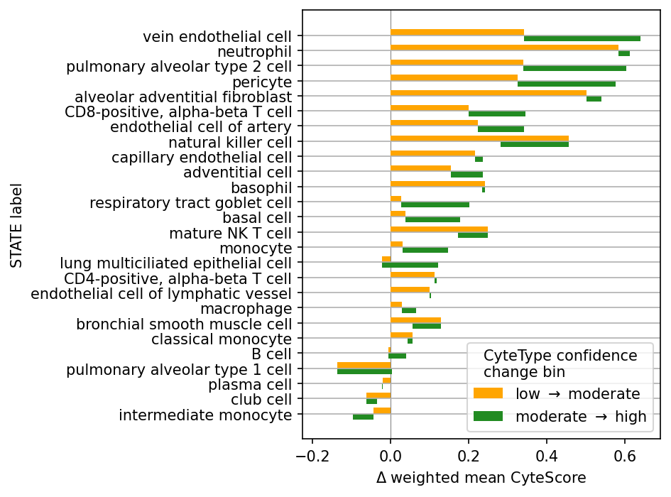
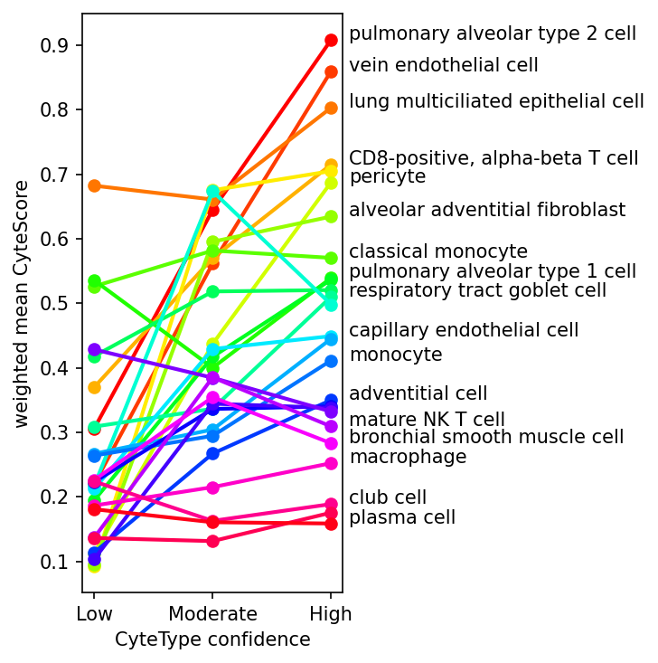
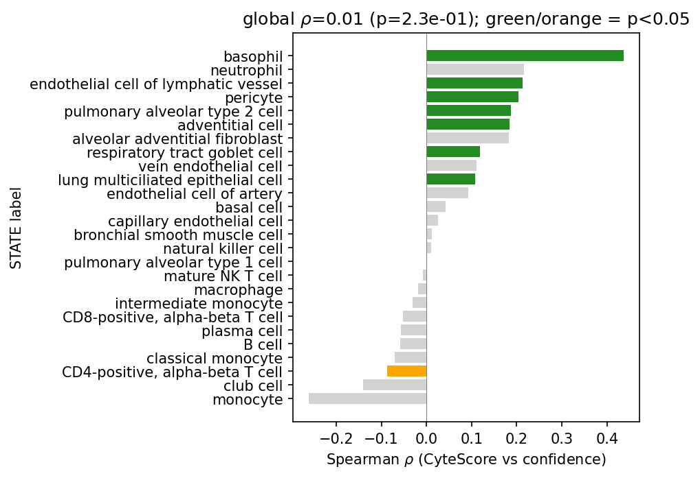

# STATE labels-CyteScore-CyteType confidence

This report summarizes the findings presented in [`annotation_inspection.ipynb`](annotation_inspection.ipynb). The results presented in that notebook were generated by running the pipeline at [`run_annotation_inspection_pipeline.py`](../../pipelines/run_annotation_inspection_pipeline.py).

The goal of the analysis was to determine the relationships between STATE-CyteType CyteScores and CyteType label confidence.

The findings presented below span **113** accessions and therefore **113** CyteType reports, across which there are **868** unique CyteType annotations and **26** unique STATE labels.

## Examining CyteType annotation confidence using CyteScore

CyteType assigns a confidence label (Low, Moderate, or High) to each Leiden cluster it annotates. The question is whether a STATE label's relative CyteScore standing is stable across those bands, or whether it moves up or down as confidence changes.

Since the clustering is informed by STATE labels, each cell will have a STATE label and a CyteType annotation associated with it. Those two free text labels can be compared using CyteOnto, which computes CyteScore, a metric that quantifies how similar the two labels are on a scale from 0 to 1. These CyteScores can be mapped to the data at the cell level, but are effectively resolved to the STATE-CyteType label pair level. Nonetheless, cell level data are valuable to understanding how often a given STATE-CyteType label pair appears in the data. **Figure 1** illustrates this on a single dataset. 

***Figure 1.*** *UMAP for accession SRX23724122, colored by STATE label, CyteType annotation, CyteOnto CyteScore, and CyteType cluster confidence.*

A given STATE label can appear more or less in clusters that CyteType annotates with a certain confidence level. For instance, if the STATE label "plasma cell" often appears in clusters that CyteType annotates with high confidence, it is tempting to assume that CyteType often successfully annotates cells that STATE thought were plasma cells. However, the confidence does not tell the whole story. If that high confidence cluster was annotated as a similar cell type by CyteType, such as a plasmablast, CyteType had high confidence in arriving at a similar conclusion as STATE, while if the cluster was annotated as a more different cell type, such as a basophil, CyteType had high confidence that STATE was incorrect in its annotation. A metric to quantify how similar or different these cell types are with language models is CyteOnto's CyteScore. 

| | Pair of similar labels | Pair of different labels
--- | --- | ---
**STATE label** | plasma cell | plasma cell
**CyteType annotation** | Plasmablast | Basophil
**CyteOnto CyteScore similarity** | 0.5801 | 0.1845
**CyteType annotation confidence** | High | High
**Interpretation** | CyteType is confident that STATE is correct | CyteType is confident that STATE is incorrect

***Table 1.*** *Hypothetical example of STATE label and CyteType annotation. These examples were chosen strictly for demonstration and are not on their own relevant to the findings of this document.*

### Change in CyteScore across CyteType confidence

To see how absolute CyteScore alignment changes with confidence, we plot each STATE label's cell-count-weighted mean CyteScore in each confidence band.

**A**

**B**

***Figure 2.*** ***A.*** *Weigted change in mean CyteScore for STATE labels across CyteType confidence bands. Each set of bars represents the change in CyteScore from one confidence band to another.* ***B.*** *Weighted mean CyteScore for  STATE labels across CyteType confidence bands. Each line is one STATE label, color-ordered by weighted mean CyteScore at High confidence. Note that not all STATE labels are shown in text in the figure to reduce overplotting.*

Annotations of clusters with cells labelled neutrophils by STATE tend to exhibit higher CyteScores relative to most other STATE labels as CyteType confidence increases (**Figure 2A**). This can be interpreted as when CyteType is presented with a cluster containing cells that STATE labelled as neutrophils and CyteType is **not confident** in STATE, it choses to assign the clusters **a type that is quite different** from neutrophil. However, when it is presented with a cluster with many cells that STATE labelled as neutrophils and CyteType **is confident** in its annotation, it tends to assign the cluster a **type that is similar** to neutrophil. The opposite is true for clusters with many cells that STATE labelled as intermediate monocytes. Here, CyteType tends annotate clusters with labels that are more different from intermediate monocyte when it is more confident, and more similar when it is less confident. One may interpret that CyteType is the most confident that a cluster is comprised of intermediate monocytes when STATE flagged cells in that cluster as **not** being intermediate monocytes.

To put some numbers on the figure, neutrophils have weighted mean CyteScore 0.09 in low-confidence clusters, 0.68 in moderate, and 0.71 in high: a large gain from Low to Moderate (+0.59) with little change thereafter. Intermediate monocytes move in the opposite direction (0.43 → 0.38 → 0.33), with CyteScore falling as confidence rises.

One might interpret this as a sign that STATE is "good" at identifying neutrophils and "bad" at identifying intermediate monocytes, though this may be oversimplification. Indeed, when encountering clusters containing cells annotated as neutrophils or intermediate monocytes by STATE, CyteType is more likely to give a assign a label to the cluster that is similar to neutrophil or different from intermediate monocyte as its confidence increases.

### Monotonicity of CyteScore trends across confidence

The degree to which the above trends exhibit monotonicity (as confidence increases, weighted mean CyteScore increases or decreases) is shown in **Figure 3**.

***Figure 3.*** *Spearman's $\rho$ across CyteType confidence for each STATE annotation. The metric was computed on all STATE-CyteType pair CyteScores. Significance is encoded in the colors of the bars. The title reports the global Spearman correlation between CyteScore and confidence across all pair-level rows ($\rho=0.01$, $p=0.23$). Thus, the data as a whole are not significantly monotinic.*

The metric was computed on all STATE-CyteType pair CyteScores and is therefore unweighted. Therefore, these data should be considered a complement to **Figure 2**. **Figure 3** shows that quite a few STATE annotations exhibit a significant positive correlation between confidence and CyteScore, while only one does for negative correlation. However, on a whole, the data suggest that monononicity is not present in the dataset as a whole (insignificant global rho), which might be due to the distribution of the STATE rhos.

### How weighted mean CyteScore is computed

For each confidence band (Low, Moderate, High):

1. **Average CyteScore per STATE label, weighted by cell count.** Take every pair-level row in the band, weight each row's `cytescore_similarity` by its `n_cells`, and average:

$$
\bar{s} = \frac{\sum_i s_i \, n_i}{\sum_i n_i}
$$

where the sum runs over the rows for one STATE label in one band, $s_i$ is that row's `cytescore_similarity`, and $n_i$ is its `n_cells`. Bigger pairings count more; single-cell pairings barely move the average.

2. **Plot $\bar{s}$ for each band** as one point per STATE label and connect the three bands with a line.

### Caveats

- Weighting by `n_cells` means high-cell pairings dominate each band's mean. A STATE label represented mostly by single-cell pairs will be more sensitive to a few large-count pairings.
- The number of pair rows differs across bands (561 Low, 4226 Moderate, 3593 High in this run), so each band's mean is computed over a slightly different subset of pairings.
- Lines cross between bands, so relative standing is not fixed across confidence levels even when the pooled Spearman trend is weak.

## Conclusion

The three figures address the relationship between CyteScore and CyteType confidence at different levels of aggregation:

- **Figure 1** provides a single-dataset view of how STATE labels, CyteType annotations, CyteScores, and confidence labels relate spatially, complementing the pair-level aggregates in **Figures 1** and **2**.
- **Figure 2** plots each STATE label's weighted mean CyteScore across CyteType confidence bands. Lines cross frequently, so relative standing is not stable across bands; labels such as neutrophil and natural killer cell gain sharply from Low to Moderate confidence, while intermediate monocyte declines. The pooled Spearman correlation is weak ($\rho \approx 0.01$), so the global trend does not summarize per-label behavior.
