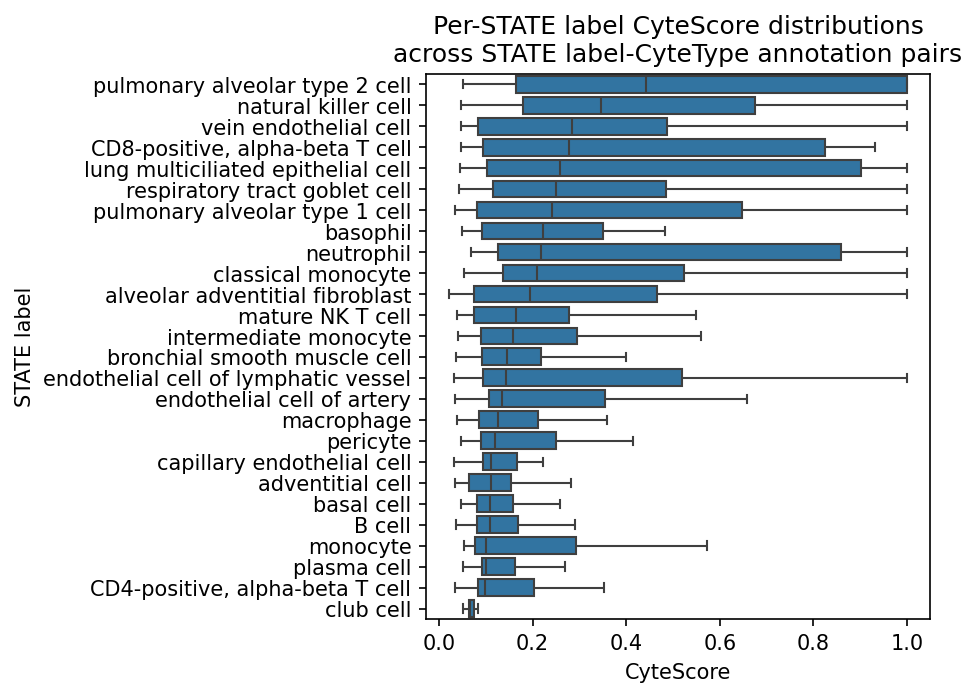
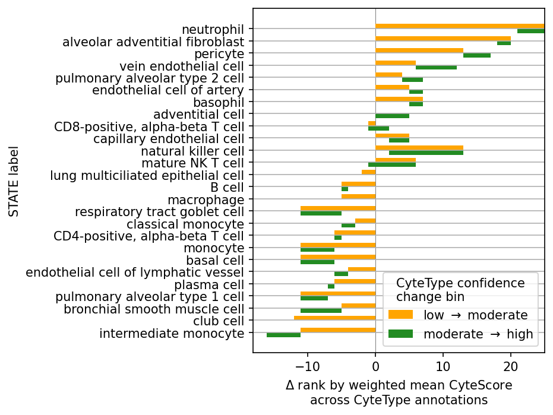
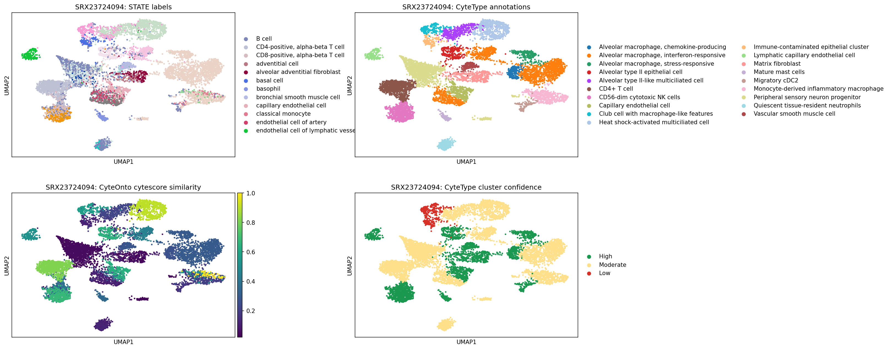

# STATE labels-CyteScore-CyteType confidence

This report summarizes the findings presented in [`annotation_inspection.ipynb`](annotation_inspection.ipynb). The results presented in that notebook were generated by running the pipeline at [`run_annotation_inspection_pipeline.py`](../../pipelines/run_annotation_inspection_pipeline.py).

The goal of the analysis was to determine the relationships between STATE-CyteType CyteScores and CyteType label confidence.

The findings presented below span **113** accessions and therefore **113** CyteType reports, across which there are **868** unique CyteType annotations and **26** unique STATE labels.

## Per-STATE CyteScore varies widely across STATE-CyteType pairs

***Figure 1.*** *Per-STATE distribution of CyteScore (`cytescore_similarity`) across all STATE label-CyteType annotation pairs, ordered by median CyteScore (descending).*

Each point is a pair-level observation: one STATE label matched to one CyteType annotation in one accession. A STATE label therefore appears as many boxplot points as it has distinct CyteType pairings across the dataset. STATE labels at the top of the plot (e.g. pulmonary alveolar type 2 cell, natural killer cell) tend to receive higher CyteScores from CyteOnto; STATE labels at the bottom (e.g. club cell, CD4-positive alpha-beta T cell) tend to receive lower scores. The spread within a STATE label reflects how consistently CyteOnto agrees with CyteType across the different annotations that STATE is paired with.

## Rank delta measures how much a STATE label's CyteScore standing shifts with confidence

***Figure 2.*** *Per-STATE rank delta across CyteType confidence bands. Orange: `low -> moderate`; green: `moderate -> high`. Bars sorted by total delta (ascending).*

CyteType assigns each Leiden cluster a confidence label (Low, Moderate, or High). The question is whether a STATE label's relative CyteScore standing is stable across those bands, or whether it moves up or down as confidence changes.

### How rank delta is computed

The whole computation is four steps, applied once per confidence band (Low, Moderate, High):

1. **Average CyteScore per STATE label, weighted by cell count.** Take every pair-level row in the band, weight each row's `cytescore_similarity` by its `n_cells`, and average:

$$
\bar{s} = \frac{\sum_i s_i \, n_i}{\sum_i n_i}
$$

where the sum runs over the rows for one STATE label in one band, $s_i$ is that row's `cytescore_similarity`, and $n_i$ is its `n_cells`. Bigger pairings count more; single-cell pairings barely move the average.

2. **Rank the STATE labels** by $\bar{s}$ within the band (rank 0 = lowest).

3. **Take the rank differences between bands** for each STATE label: `|rank_Low - rank_Moderate|` and `|rank_Moderate - rank_High|`.

4. **Sort STATE labels** by the sum of those two differences, so the most stable labels sit at the bottom of the chart and the most volatile at the top.

### How to read the plot

The x-axis is a count of rank positions moved, not a change in CyteScore itself. A STATE label with total delta near zero (e.g. lung multiciliated epithelial cell, macrophage) holds roughly the same relative standing in all three confidence bands: its weighted mean CyteScore ranks similarly whether it appears in Low-, Moderate-, or High-confidence pairings. A STATE label with a large total delta (e.g. neutrophil, natural killer cell) shifts substantially: its weighted mean CyteScore ranks much higher or lower in one band than in another.

The orange and green segments show which transition drives the shift. A long orange segment means the rank changed mainly between Low and Moderate; a long green segment means it changed mainly between Moderate and High.

### Caveats

- Ranks are relative within each band, not absolute CyteScore values. A STATE can have a low absolute CyteScore but still rank high within a band if all other STATE labels in that band score even lower.
- Weighting by `n_cells` means high-cell pairings dominate each band's mean. A STATE label represented mostly by single-cell pairs will be more sensitive to a few large-count pairings.
- The number of pair rows differs across bands (561 Low, 4226 Moderate, 3593 High in this run), so ranks are computed over slightly different subsets of pairings.

## Single-accession UMAP grounds the aggregate metrics

***Figure 3.*** *UMAP for accession SRX23724094, colored by STATE label, CyteType annotation, CyteOnto CyteScore, and CyteType cluster confidence.*

The pipeline run underlying **Figures 1** and **2** was produced without per-cell UMAP coordinates. **Figure 3** is regenerated from a locally cached annotated h5ad (`data/cytetype_annotated/SRX23724094_annotated.h5ad`) using the same CyteScore merge and confidence mapping as in [`notebooks/analysis/confidence_vs_cytescore.ipynb`](../../notebooks/analysis/confidence_vs_cytescore.ipynb). It shows how the four variables co-localize on a single dataset: STATE labels and CyteType annotations partition the UMAP into distinct regions, CyteScore varies continuously within those regions, and confidence labels (red = Low, yellow = Moderate, green = High) attach to whole Leiden clusters rather than individual cells.

## Conclusion

The three figures address the relationship between CyteScore and CyteType confidence at different levels of aggregation:

- **Figure 1** shows that STATE labels differ systematically in their CyteScore distributions, with some STATE labels consistently scoring higher against their CyteType pairings than others.
- **Figure 2** introduces rank delta as a measure of whether a STATE label's relative CyteScore standing is stable across CyteType confidence bands. STATE labels with low total delta (e.g. lung multiciliated epithelial cell, macrophage) maintain a consistent rank regardless of confidence; STATE labels with high total delta (e.g. neutrophil, natural killer cell) shift rank substantially as confidence changes. This suggests that confidence and CyteScore alignment are not uniform across STATE labels.
- **Figure 3** provides a single-dataset view of how STATE labels, CyteType annotations, CyteScores, and confidence labels relate spatially, complementing the pair-level aggregates in **Figures 1** and **2**.
