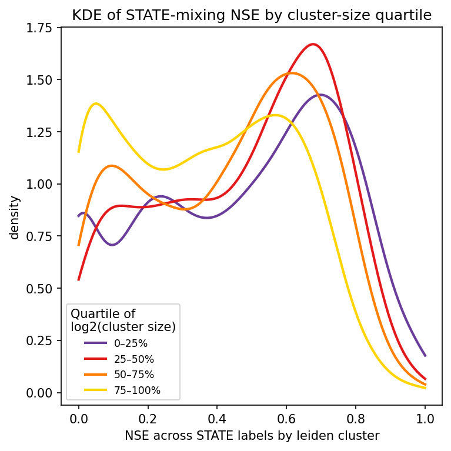
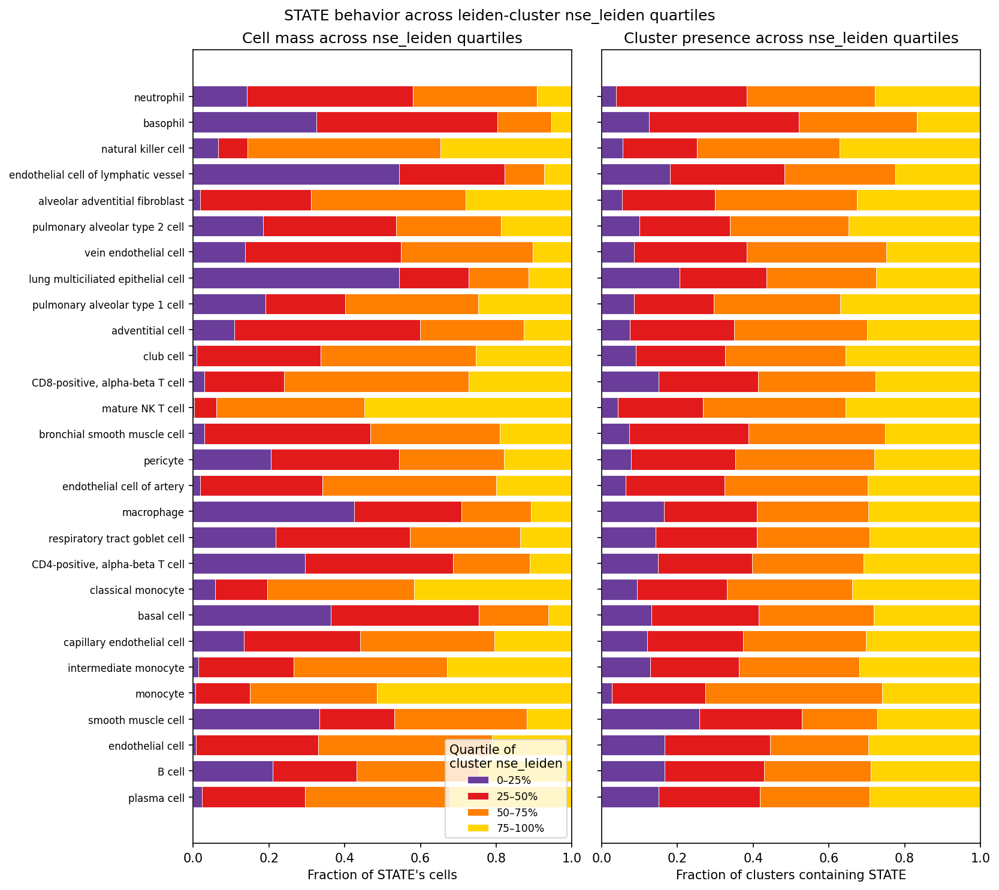

# STATE vs Leiden disagreement

Exploratory analysis on `STATE x leiden_cluster` matrices produced by [`pipelines/cluster_stats.py`](../../pipelines/cluster_stats.py), run `cluster_stats/clustered_20260509`. Source matrices live in [`output/cluster_stats/clustered_20260509/cluster_stats.json`](../../output/cluster_stats/clustered_20260509/cluster_stats.json).

Leiden clusters from the clustering pipeline are passed to CyteType for annotation. STATE labels are treated as weak priors, informing which clustering resolution is selected. This report showcases the agreement between STATE clusters and STATE-informed leiden clusters on a cluster-by-cluster basis.

The number of STATE names that appear across the data make gleaning any memorable insights difficult, since a reader is unlikely to remember the distribution of STATE names according to a given metric. The figures presented in this report are intended to serve as references to consult following CyteType clustering, and as a proof of concept that normalized Shannon entropy on the STATE x Leiden matrix can flag STATEs likely to disagree with Leiden-driven labels.

Analysis script: [state_vs_leiden.py](state_vs_leiden.py).

## Leiden cluster size does not inform entropy of STATE labels within Leiden clusters

*Figure 1. KDE of within-cluster STATE-label NSE (`nse_leiden`), split by log2(Leiden cluster size) quartile.*

The distribution of NSE is consistent across Leiden cluster quartiles, suggesting that the number of cells in a Leiden cluster does not influence the entropy of STATE labels in the cluster. Nonetheless, larger Leiden clusters appear to exhibit low STATE label entropy than small Leiden clusters, as shown by the clear separation by quartile of the KDE at low NSE. This suggests that on the whole, a large Leiden cluster may be less likely to contain evenly mixed STATE labels than a small Leiden cluster.

## Two complementary views on STATE-Leiden agreement

The next two figures are both organized one row per STATE, but they pivot on different entropies and answer different questions. STATE labels represented in fewer than 7 datasets are not shown.

*Figure 2. Per-STATE distribution of `nse_STATE` (entropy across Leiden clusters within a single accession), one observation per accession, sorted by median (top) and variance (bottom) and colored by cell category.*

A STATE with low median NSE and low variance, like neutrophils or basophils, consistently concentrates in only a few Leiden clusters across accessions. That makes the STATE easy for a clustering-based annotator to "find", provided the cluster it ends up in is also dominated by it.

At the other extreme, some STATE labels sit at consistently high NSE in every accession: their cells are spread broadly across Leiden clusters in every dataset where they appear. This is the pattern expected of STATE labels that bundle several transcriptionally distinct populations under one umbrella, or whose expression signature overlaps with that of co-occurring STATEs. Leiden does not isolate these labels in any single accession, so a CyteType call on any of the clusters they touch will reflect whichever subpopulation or co-occurring STATE dominates locally.

The normalization in NSE applies to each individual measurement, not to the distribution of medians across STATEs. In principle, every STATE could have a median near zero (every label consistently concentrated in a few Leiden clusters) or every STATE could have a median near one (every label consistently spread across many clusters). What we see instead is a continuum: some STATE labels are reliably well-isolated by Leiden, others are reliably mixed in with other STATEs, and many sit somewhere in between. The most natural reading is that STATE labels in this collection are not all at the same biological granularity: some name a tight, transcriptionally coherent population that Leiden picks out, others act as broad bins that Leiden splits across several clusters.

The variance panel layers a second axis on top of this: low variance means a STATE behaves the same way in every accession (uniformly concentrated or uniformly spread), high variance means its placement in the clustering shifts with the dataset, which is consistent with accession-specific composition, tissue context, or batch effects influencing where its cells land.

*Figure 3. Per-STATE share of cells (left) and Leiden clusters (right) across `nse_leiden` quartiles, ordered by ascending median `nse_STATE` to match Figure 2 (top).*

Reading top to bottom, STATEs progress from concentrating within few Leiden clusters per accession to spreading across many. A STATE near the top with most of its cells in q1 sits in Leiden clusters dominated by a single STATE label, so a program like CyteType, which only sees the cluster-level expression, has a clear signal to work with. A STATE whose cells fall mostly in q3 or q4 sits in mixed clusters, and CyteType may be "blind" to it because the cluster's expression is driven by whichever STATE dominates that mix.

There is no clear vertical gradient in Figure 3: a STATE's median `nse_STATE` does not predict the `nse_leiden` quartiles of the Leiden clusters its cells occupy. Concentrating within few Leiden clusters per accession (low `nse_STATE`) does not imply that those clusters are themselves dominated by a single STATE (low `nse_leiden`), and the two entropies should be read as complementary rather than redundant.

Read together: the boxplots tell you whether a STATE *lands in few clusters*, the quartile bars tell you whether *those clusters are clean*. Both need to hold for CyteType to recover the STATE; if either fails, the STATE is at risk of being mislabelled or absorbed.

## Conclusion

STATE labels are not ground truth; they are weak priors used to guide clustering resolution. A STATE being mislabelled or absorbed relative to a CyteType call is not, in itself, an error to fix, because the cell-type call that is used downstream is the CyteType one. STATE-Leiden disagreement is therefore characterized here as a signal about how confidently CyteType can place a given cell population relative to how it was classified by STATE, not as a defect of either side.

The three figures together provide that characterization:

- Figure 1 establishes that within-cluster STATE entropy (`nse_leiden`) is largely independent of Leiden cluster size, with a modest tendency for the largest clusters to be more STATE-pure. Cluster size on its own is therefore a poor proxy for STATE-Leiden agreement.
- Figure 2 ranks STATE labels by how concentrated they are across Leiden clusters within an accession (`nse_STATE`). STATEs at the top of the median panel (e.g. neutrophils, basophils) consistently land in a few clusters across accessions; STATE labels further down the panel consistently spread across many Leiden clusters. NSE is normalized per measurement, so a continuum of medians is not a foregone conclusion: the medians could all be near zero or all near one. The fact that they instead span the full range suggests STATE labels here are not at uniform biological granularity, with some naming a tight cell type that Leiden isolates and others acting as broad bins that Leiden splits across many clusters.
- Figure 3, ordered to match the top panel of Figure 2, shows where the cells of each STATE land along the `nse_leiden` axis. The absence of a vertical gradient confirms that being concentrated (low `nse_STATE`) does not imply being in clean clusters (low `nse_leiden`); the two entropies have to be checked together.

In practice, the two entropies are intended to be consulted side by side when interpreting a CyteType label. If a STATE has low `nse_STATE` (Figure 2) and most of its cells fall in q1 clusters (Figure 3), CyteType is working with a Leiden cluster that is similar to the STATE prior. If either condition fails, CyteType is working with a noisier signal for that STATE, and the resulting label should be read as an independent opinion rather than as a contradicted ground truth.