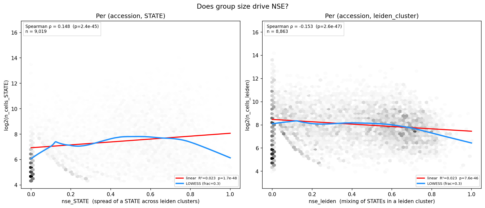
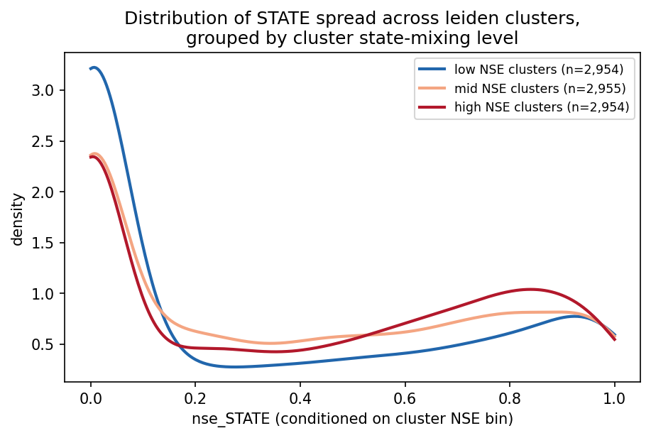
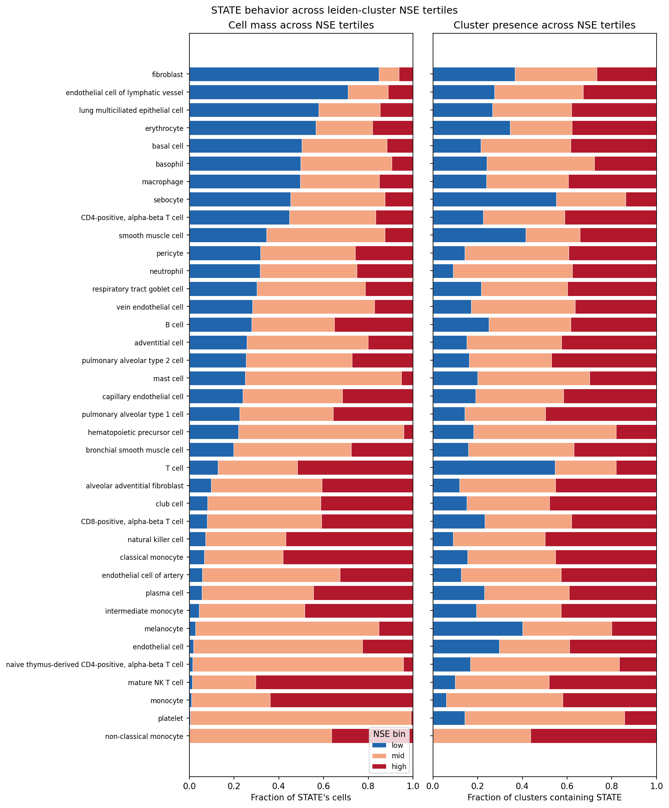

# STATE vs leiden disagreement

Exploratory analysis on `STATE x leiden_cluster` matrices produced by [`pipelines/cluster_stats.py`](../../pipelines/cluster_stats.py), run `cluster_stats/clustered_20260509`. Source matrices live in [`output/cluster_stats/clustered_20260509/cluster_stats.json`](../../output/cluster_stats/clustered_20260509/cluster_stats.json).

Leiden clusters from the clustering pipeline are passed to CyteType for annotation. STATE labels are treated as weak priors, informing which clustering resolution is selected. This report showcases the agreement between STATE clusters and STATE-informed leiden clusters on a cluster-by-cluster basis.

The number of STATE names that appear across the data make gleaning any memorable insights difficult—a reader is unlikely to remember the distribution of STATE names according to a given metric. The figures presented in this report are intended to serve as references to consult following CyteType clustering and as proof-of-concept of 

Analysis script: [state_vs_leiden.py](state_vs_leiden.py).

## Leiden cluster size does not inform entropy of STATE labels within Leiden clusters

<!-- 

Lognormal fit of leiden cluster sizes pooled across accessions, plus the KS goodness-of-fit statistic. -->

KDE of STATE-mixing NSE (normalized Shannon entropy) within each Leiden cluster, split by log2(cluster size) quartile. The distribution of NSE is consistent across Leiden cluster quartiles, suggesting that the number of cells in a Leiden cluster does not influence the entropy of STATE labels in the cluster. Nonetheless, larger Leiden clusters appear to exhibit low STATE label entropy than small Leiden clusters, as shown by the clear separation by quartile of the KDE at low NSE. This suggests that on the whole, a large Leiden cluster may be less likely to contain evenly mixed STATE labels than a small Leiden cluster.

<!-- 

NSE against log2(group size) for STATEs (left) and leiden clusters (right) with linear and LOWESS fits and Spearman rho shows that a cluster's size has a limited impact on NSE (normalized Shannon entropy). -->

<!-- 

Distribution of `nse_STATE` conditioned on the NSE tertile of the leiden cluster it appears in. -->

## Assessment of mixing across STATE labels

Per-STATE share of cells and clusters that fall in low, mid, and high NSE leiden tertiles. STATEs sorted by share of cells in the low tertile. A STATE label that appears in 

Per-STATE distribution of NSE (normalized Shannon entropy) across accessions, sorted by median (top) and variance (bottom), colored by cell category. STATE clusters such as neutrophils and basophils exhibit low NSE and low variance of NSE, meaning that 
