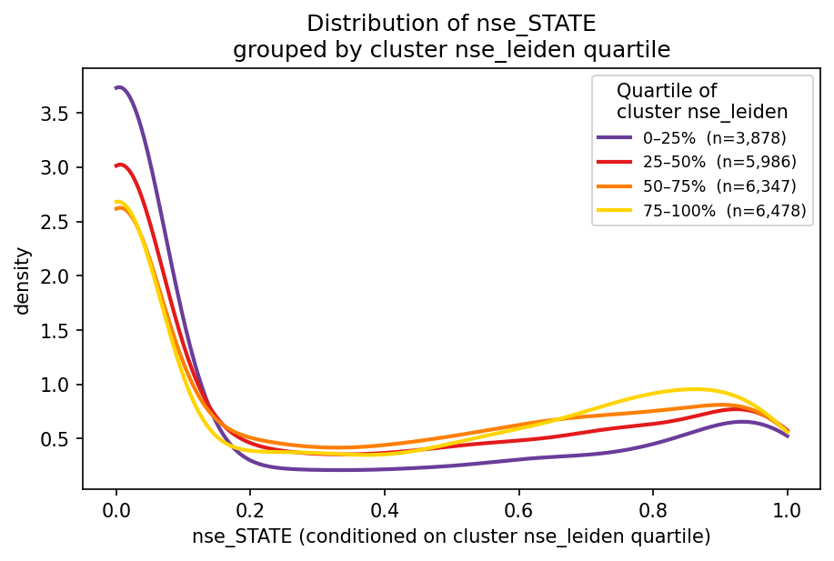

# STATE vs Leiden disagreement

Exploratory analysis on `STATE x leiden_cluster` matrices produced by `[pipelines/cluster_stats.py](../../pipelines/cluster_stats.py)`, run `cluster_stats/clustered_20260509`. Source matrices live in `[output/cluster_stats/clustered_20260509/cluster_stats.json](../../output/cluster_stats/clustered_20260509/cluster_stats.json)`.

Leiden clusters from the clustering pipeline are passed to CyteType for annotation. STATE labels are treated as weak priors, informing which clustering resolution is selected. This report showcases the agreement between STATE clusters and STATE-informed leiden clusters on a cluster-by-cluster basis.

The number of STATE names that appear across the data make gleaning any memorable insights difficult, since a reader is unlikely to remember the distribution of STATE names according to a given metric. The figures presented in this report are intended to serve as references to consult following CyteType clustering, and as a proof of concept that normalized Shannon entropy on the STATE x Leiden matrix can flag STATEs likely to disagree with Leiden-driven labels.

Analysis script: [state_vs_leiden.py](state_vs_leiden.py).

## Leiden cluster size does not inform entropy of STATE labels within Leiden clusters

KDE of STATE-mixing NSE (normalized Shannon entropy) within each Leiden cluster, split by log2(cluster size) quartile. The distribution of NSE is consistent across Leiden cluster quartiles, suggesting that the number of cells in a Leiden cluster does not influence the entropy of STATE labels in the cluster. Nonetheless, larger Leiden clusters appear to exhibit low STATE label entropy than small Leiden clusters, as shown by the clear separation by quartile of the KDE at low NSE. This suggests that on the whole, a large Leiden cluster may be less likely to contain evenly mixed STATE labels than a small Leiden cluster.

## Distribution of `nse_STATE` shifts with cluster `nse_leiden` quartile

KDE of `nse_STATE` for STATE-by-accession pairs, grouped by the `nse_leiden` quartile of the Leiden clusters they appear in. STATEs with fewer than 7 non-empty accessions are excluded, matching the filter used in the per-STATE figures below. Quartile colors match the cluster-size KDE above so the four bands are read the same way: lowest quartile in purple, highest in yellow.

## Two complementary views on STATE-Leiden agreement

The next two figures are both organized one row per STATE, but they pivot on different entropies and answer different questions.

Per-STATE distribution of `nse_STATE` (entropy across Leiden clusters within a single accession), one observation per accession, sorted by median (top) and variance (bottom) and colored by cell category. A STATE with low median NSE and low variance, like neutrophils or basophils, consistently concentrates in only a few Leiden clusters across accessions. That makes the STATE easy for a clustering-based annotator to "find", provided the cluster it ends up in is also dominated by it.

Per-STATE share of cells (left) and Leiden clusters (right) that fall in each `nse_leiden` quartile, sorted by share of cells in the lowest quartile. A STATE near the top sits in Leiden clusters that are dominated by a single STATE label, so a program like CyteType, which only sees the cluster-level expression, has a clear signal to work with. A STATE near the bottom sits in mixed clusters, and CyteType may be "blind" to it because the cluster's expression is driven by whichever STATE dominates that mix.

Read together: the boxplots tell you whether a STATE *lands in few clusters*, the quartile bars tell you whether *those clusters are clean*. Both need to hold for CyteType to recover the STATE; if either fails, the STATE is at risk of being mislabelled or absorbed.